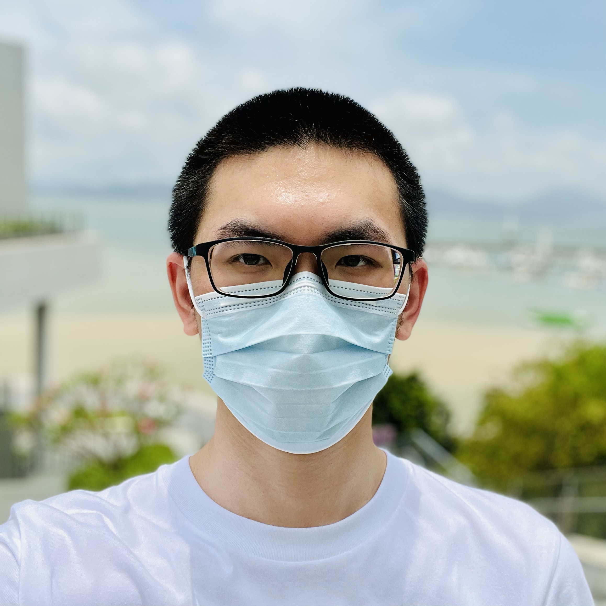

+++
title = "About Me"
hidden = true
date = "2022-07-25"
date_update = true
+++

I am currently a master’s student at [Carnegie Mellon University][cmu]. I obtained my Bachelor’s degree in computer science from [Shanghai Jiao Tong University][sjtu].

[sjtu]: http://en.sjtu.edu.cn/
[cmu]: https://www.cs.cmu.edu/

My real name is Chi Zhang. However, as the name is too common in Chinese culture, I’m generally referred to **Alex Chi**.

Knowing oneself is hard, and I spent two years figuring out what I enjoyed most.

In my second year at SJTU, I applied for a research internship. It turned out that the whole experience was a disaster for me. I had nothing to do for half a year except attend weekly lab meetups. I had no idea what the team was doing or what I could do. I suffered a lot, questioning myself, “Am I qualified for this position?” The next semester I quit that team. Only then did I find myself more of an engineer than a researcher.

During my third year in SJTU, I lost interest in most of my courses, where teachers tediously taught outdated materials, and our students competed for GPA in a non-sense way. It is relatively easy for me to get a high score, but I could hardly learn anything throughout the process. I criticized on how our university educates our students [[1]](https://zhuanlan.zhihu.com/p/345269981) [[2]](https://survivesjtu.gitbook.io/survivesjtumanual/fu-lu/ben-ke-sheng-zhuan-ye-jie-shao-todo/cs-zi-jiu-zhi-bei) and made efforts to improve the current situation. After that, some professors took my advice and made their course more approachable and meaningful.

Luckily, after long frustration and struggling, I have a vague idea of what my future life should become: do solid work, build exciting things and make software used by a large community.

I have focused on building system software for the past three years, especially database systems. I built [AgateDB][agatedb] during my internship in PingCAP, worked on [TerarkDB][terarkdb] for Zoned Namespace SSDs at ByteDance, and participated in the early stage development of [RisingWave][risingwave] at RisingWave Labs (formerly known as Singularity Data).

[agatedb]: https://github.com/tikv/agatedb
[terarkdb]: https://github.com/bytedance/terarkdb

Also, I love becoming part of the open-source community. I’m currently the [TiKV project’s][tikv] maintainer. In addition, I maintain several widely-used projects like SJTUG mirror and SJTUThesis in the [SJTUG community][sjtug]. Furthermore, to enable more students to learn about database systems, I built an educational OLAP database called [RisingLight][risinglight] with my friends. The SQL layer of RisingLight was then ported to [BusTub](https://github.com/cmu-db/bustub), the course project for CMU 15-445/645 Database Systems, which made BusTub become a real "SQL" database system.

[tikv]: https://tikv.org
[sjtug]: https://github.com/sjtug
[risinglight]: https://github.com/risinglightdb/risinglight
[risingwave]: https://github.com/singularity-data/risingwave

For the future, I am constantly seeking opportunities to build things that excite me and impact people.

My profile photo

*Shot with iPhone 13 Pro (Front Camera) at Sea World Culture and Arts Center, Shenzhen City, Guangdong Province, P.R. China*

