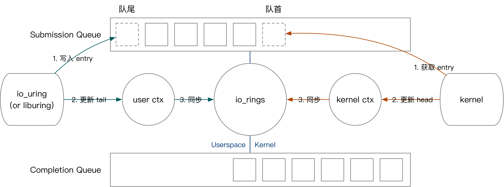
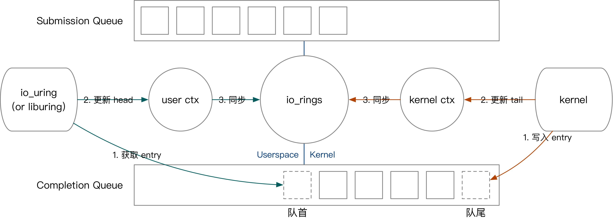
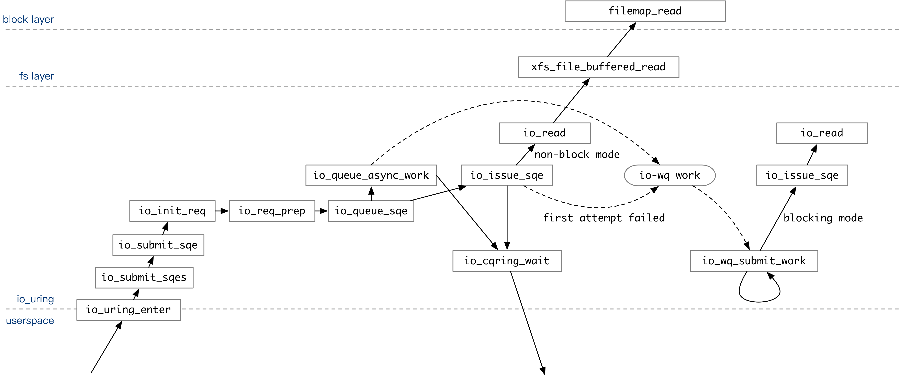
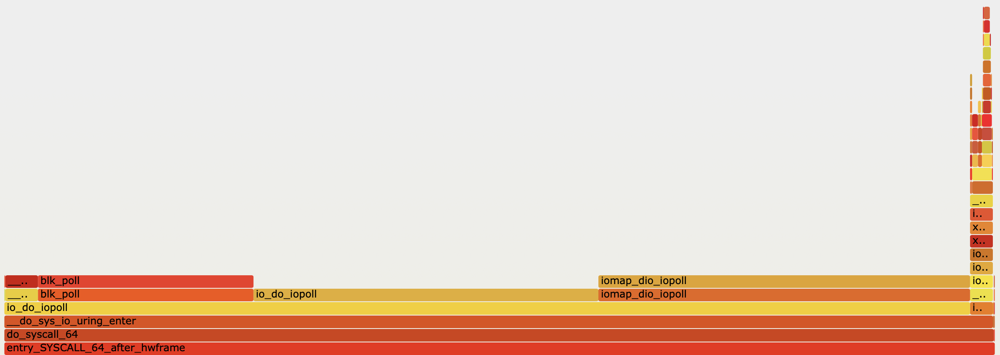
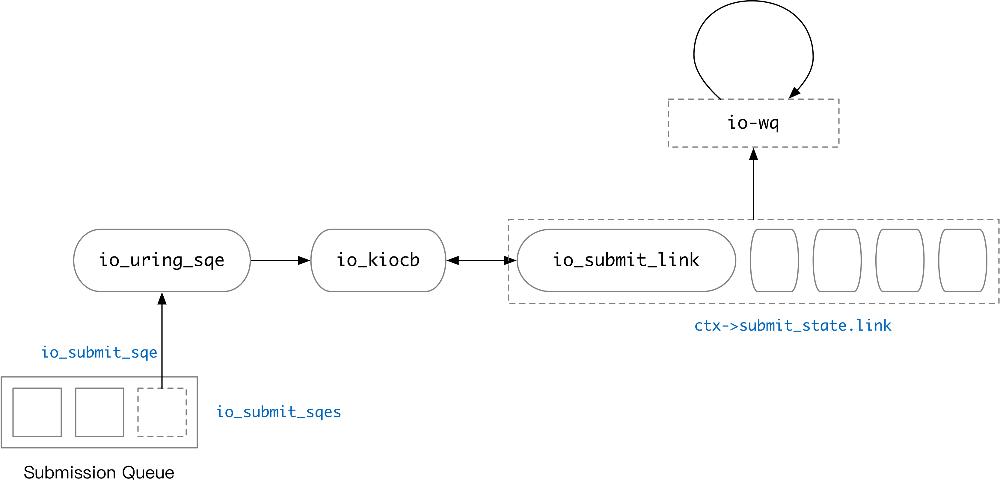

+++
title = "io_uring 的接口与实现"
date = "2021-06-14T22:00:00+08:00"
toc = true
tags = ["io_uring", "io-uring", "Linux", "代码解析"]
categories = ["Tech"]
+++

`io_uring` 是 Linux 提供的一个异步 I/O `接口。io_uring` 在 2019 年加入 Linux 内核，经过了两年的发展，现在已经变得非常强大。本文基于 Linux 5.12.10 介绍 `io_uring` 接口。

`io_uring` 的实现主要在 [`fs/io_uring.c`](https://elixir.bootlin.com/linux/v5.12.10/source/fs/io_uring.c) 中。

## io_uring 的 用户态 API

`io_uring` 的实现仅仅使用了三个 syscall：`io_uring_setup`, `io_uring_enter` 和 `io_uring_register`。它们分别用于设置 `io_uring` 上下文，提交并获取完成任务，以及注册内核用户共享的缓冲区。使用前两个 syscall 已经足够使用 `io_uring` 接口了。

用户和内核通过提交队列和完成队列进行任务的提交和收割。后文中会出现大量的简写，在这里先做一些介绍。

| 缩略语 | 英语 | 中文 | 解析 |
| ---- | ---- | ---- | ---- |
| SQ | Submission Queue | 提交队列 | 一整块连续的内存空间存储的环形队列。<br>用于存放将执行操作的数据。 |
| CQ | Completion Queue | 完成队列 | 一整块连续的内存空间存储的环形队列。<br>用于存放完成操作返回的结果。 |
| SQE | Submission Queue Entry | 提交队列项 | 提交队列中的一项。 |
| CQE | Completion Queue Entry | 完成队列项 | 完成队列中的一项。 |
| Ring | Ring | 环 | 比如 SQ Ring，就是“提交队列信息”的意思。<br>包含队列数据、队列大小、丢失项等等信息。 |

### 初始化 io_uring

```c
long io_uring_setup(u32 entries, struct io_uring_params __user *params)
```

用户通过调用 `io_uring_setup` [^2] 初始化一个新的 `io_uring` 上下文。该函数返回一个 file descriptor，并将 `io_uring` 支持的功能、以及各个数据结构在 `fd` 中的偏移量存入 `params`。用户根据偏移量将 `fd` 映射到内存 (mmap) 后即可获得一块内核用户共享的内存区域。这块内存区域中，有 `io_uring` 的上下文信息：提交队列信息 (`SQ_RING`) 和完成队列信息 (`CQ_RING`)；还有一块专门用来存放提交队列元素的区域 (SQEs)。`SQ_RING` 中只存储 SQE 在 SQEs 区域中的序号，`CQ_RING` 存储完整的任务完成数据。[^1]


在 Linux 5.12 中，SQE 大小为 64B，CQE 大小为 16B。因此，相同数量的 SQE 和 CQE 所需要的空间不一样。初始化 `io_uring` 时，用户如果不在 `params` 中设置 CQ 长度，内核会分配 `entries` 个 SQE，以及 `entries * 2` 个 CQE。

`io_uring_setup` 设计的巧妙之处在于，内核通过一块和用户共享的内存区域进行消息的传递。在创建上下文后，任务提交、任务收割等操作都通过这块共享的内存区域进行，在 `IO_SQPOLL` 模式下（后文将详细介绍），可以完全绕过 Linux 的 syscall 机制完成需要内核介入的操作（比如读写文件），大大减少了 syscall 切换上下文、刷 TLB 的开销。

[^1]: `SQ_RING`, `CQ_RING` 的类型均为 `struct io_rings`, 存放提交队列元素的区域是 `struct io_uring_sqe` 的数组。事实上，单个 `io_rings` 结构体既包括 SQ 信息，也包括 CQ 信息。当前的 io_uring 实现中，SQ、CQ 对应的区域指向同一个 `io_rings` 结构体。举个例子，params 中有 `io_sqring_offsets sq_off`。通过 `*(sq_ring_ptr + sq_off.head)` 和 `*(cq_ring_ptr + sq_off.head)` 都可以访问到 SQ 的队首编号。

[^2]: [[io_uring.c#L9658]](https://elixir.bootlin.com/linux/v5.12.10/source/fs/io_uring.c#L9658)

### 任务的描述

`io_uring` 可以处理多种 I/O 相关的请求。比如：

* 文件相关：read, write, open, fsync, fallocate, fadvise, close
* 网络相关：connect, accept, send, recv, epoll_ctl
* 等等

下面以 `fsync` 为例，介绍执行这个操作中可能用到的结构体和函数。

#### 操作的定义与实现

`io_op_def io_op_defs[]` 数组中定义了 `io_uring` 支持的操作，以及它在 `io_uring` 中的一些参数。[^3] 比如 `IORING_OP_FSYNC`：

[^3]: [[io_uring.c#L860]](https://elixir.bootlin.com/linux/v5.12.10/source/fs/io_uring.c#L860)

```c
static const struct io_op_def io_op_defs[] = {
        ...
        [IORING_OP_FSYNC] = {
                .needs_file		= 1,
        },
        ...
```

`io_uring` 中几乎每个操作都有对应的准备和执行函数。比如 `fsync` 操作就对应 `io_fsync_prep` 和 `io_fsync` 函数。

```c
static int io_fsync_prep(struct io_kiocb *req, const struct io_uring_sqe *sqe);
static int io_fsync(struct io_kiocb *req, unsigned int issue_flags);
```

除了 `fsync` 这种同步（阻塞）操作，内核中还支持一些异步（非阻塞）调用的操作，比如 Direct I/O 模式下的文件读写。对于这些操作，`io_uring` 中还会有一个对应的异步准备函数，以 `_async` 结尾。比如：

```c
static inline int io_rw_prep_async(struct io_kiocb *req, int rw);
```

这些函数就是 `io_uring` 对某个 I/O 操作的包装。

#### 操作信息的传递

用户将需要进行的操作写入 `io_uring` 的 SQ 中。在 CQ 中，用户可以收割任务的完成情况。这里，我们介绍 SQE 和 CQE 的编码。

`include/uapi/linux/io_uring.h` [^4] 中定义了 SQE 和 CQE。SQE 是一个 64B 大小的结构体，里面包含了所有操作可能用到的信息。

[^4]: [`include/uapi/linux/io_uring.h`](https://elixir.bootlin.com/linux/v5.12.10/include/uapi/linux/io_uring.h)

<details>

<summary><code>io_uring_sqe</code> 的定义</summary>

```c
struct io_uring_sqe {
        __u8	opcode;		/* type of operation for this sqe */
        __u8	flags;		/* IOSQE_ flags */
        __u16	ioprio;		/* ioprio for the request */
        __s32	fd;		/* file descriptor to do IO on */
        union {
                __u64	off;	/* offset into file */
                __u64	addr2;
        };
        union {
                __u64	addr;	/* pointer to buffer or iovecs */
                __u64	splice_off_in;
        };
        __u32	len;		/* buffer size or number of iovecs */
        union {
                __kernel_rwf_t	rw_flags;
                __u32		fsync_flags;
                ...
        };
        __u64	user_data;	/* data to be passed back at completion time */
        union {
        ...
        };
};
```

</details>


CQE 是一个 16B 大小的结构体，包含操作的执行结果。

```c
struct io_uring_cqe {
        __u64	user_data;	/* sqe->data submission passed back */
        __s32	res;		/* result code for this event */
        __u32	flags;
};
```

继续以 `fsync` 为例。要在 `io_uring` 中完成 `fsync` 操作，用户需要将 SQE 中的 `opcode` 设置为 `IORING_OP_FSYNC`，将  `fd` 设置为需要同步的文件，并填充 `fsync_flags`。其他操作也是类似，设置 opcode 并将操作所需要的参数并写入 SQE 即可。

通常来说，使用 `io_uring` 的程序都需要用到 64 位的 `user_data` 来唯一标识一个操作 [^5]。`user_data` 是 SQE 的一部分。`io_uring` 执行完某个操作后，会将这个操作的 `user_data` 和操作的返回值一起写入 CQ 中。

[^5]: 大多数情况下，这个数据会是一个指针，指向该操作对应的用户上下文。本人之前的 [在 Rust 中实现基于 `io_uring` 的异步随机读文件](/posts/articles/2021-01-30-async-random-read-with-rust/) 就介绍了一种 `io_uring` 的用户态接口实现。`user_data` 存储 `UringTask` 结构体的内存地址。

### 任务的提交与完成

`io_uring` 通过环形队列和用户交互。



我们的先以用户提交任务为例，介绍 `io_uring` 的内核用户交互方式。用户提交任务的过程如下：

* 将 SQE 写入 SQEs 区域，而后将 SQE 编号写入 SQ。（对应图中绿色第一步）
* 更新用户态记录的队头。（对应图中绿色第二步）
* 如果有多个任务需要同时提交，用户不断重复上面的过程。
* 将最终的队头编号写入与内核共享的 `io_uring` 上下文。（对应图中绿色第三步）

接下来我们简要介绍内核获取任务、内核完成任务、用户收割任务的过程。

* 内核态获取任务的方式是，从队尾读取 SQE，并更新 `io_uring` 上下文的 SQ tail。



* 内核态完成任务：往 CQ 中写入 CQE，更新上下文 CQ head。
* 用户态收割任务：从 CQ 中读取 CQE，更新上下文 CQ tail。

## io_uring 的实现

介绍完 `io_uring` 的用户态接口后，我们就可以详细介绍 `io_uring` 在内核中是如何实现的了。

`io_uring` 在创建时有两个选项，对应着 `io_uring` 处理任务的不同方式：

* 开启 `IORING_SETUP_IOPOLL` 后，`io_uring` 会使用轮询的方式执行所有的操作。
* 开启 `IORING_SETUP_SQPOLL` 后，`io_uring` 会创建一个内核线程专门用来收割用户提交的任务。

这些选项的设定会影响之后用户与 `io_uring` 交互的方式：

* 都不开启，通过 `io_uring_enter` 提交任务，收割任务无需 syscall。
* 只开启 `IORING_SETUP_IOPOLL`，通过 `io_uring_enter` 提交任务和收割任务。
* 开启 `IORING_SETUP_SQPOLL`，无需任何 syscall 即可提交、收割任务。内核线程在一段时间无操作后会休眠，可以通过 `io_uring_enter` 唤醒。

### 基于内核线程的任务执行

每个 `io_uring` 都由一个轻量级的 io-wq[^6] 线程池支持，从而实现 Buffered I/O 的异步执行。对于 Buffered I/O 来说，文件的内容可能在 page cache 里，也可能需要从盘上读取。如果文件的内容已经在 page cache 中，这些内容可以直接在 `io_uring_enter` 的时候读取到，并在返回用户态时收割。否则，读写操作会在 workqueue 里执行。

[^6]: [io-wq patchset](https://lore.kernel.org/linux-block/20191024134439.28498-1-axboe@kernel.dk/T/)

如果没有在创建 `io_uring` 时指定 `IORING_SETUP_IOPOLL` 选项，`io_uring` 的操作就会放进 io-wq 中执行。



上图覆盖了关闭 `IOPOLL` 模式下，用户通过 `io_uring` 执行操作的整个调用流程。用户提交的 SQE 经过一系列处理后，会在 `io_queue_sqe` 中试探着执行一次。

* 如果在 SQE 中指定了 `IOSQE_ASYNC` 选项，该操作会直接被放入 io-wq 队列。
* 如果没有指定 `IOSQE_ASYNC` 选项，`io_uring` 会先用非阻塞模式尝试执行一次 SQE 中包含的操作。举个例子：执行 `io_read` 时，如果数据已经在 page cache 里面，非阻塞模式的 `io_read` 操作就会成功。如果成功，则直接返回。如果不成功，放入 io-wq 中。

所有的操作都被提交到内核队列后，如果用户设置了 `IORING_ENTER_GETEVENTS` flag，`io_uring_enter` 在返回用户态前会等待指定个数的操作完成。

之后，Linux 随时会调度 io-wq 的内核线程执行。此时，`io_wq_submit_work` 函数会不断用阻塞模式执行用户指定的操作。某个操作完整执行后，它的返回值就会被写入 CQ 中。用户通过 `io_uring` 上下文中的 CQ 队尾位置就能知道内核处理好了哪些操作，无需再次调用 `io_uring_enter`。


通过火焰图可以观察到，在关闭 IOPOLL 时，内核会花大量时间处理读取操作。

### 基于轮询的任务执行

创建 `io_uring` 时指定 `IORING_SETUP_IOPOLL` 选项即可开启 I/O 轮询模式。通常来说，用 `O_DIRECT` 模式打开的文件支持使用轮询模式读写内容，执行 read / write 操作。

在轮询模式下，`io_uring_enter` 只负责把操作提交到内核的文件读写队列中。之后，用户需要多次调用 `io_uring_enter` 来轮询操作是否完成。


在轮询模式下，io-wq 不会被使用。提交任务时，`io_read` 直接调用内核的 Direct I/O 接口向设备队列提交任务。

如果用户设置了 `IORING_ENTER_GETEVENTS` flag，在返回用户态前，`io_uring_enter` 会通过 `io_iopoll_check` 调用内核接口轮询任务是否完成。



通过火焰图可以看到，`io_uring_enter` 在提交任务这一块只花了一小部分时间。大部分时间都在轮询 I/O 操作是否完成。

## io_uring 的任务依赖管理

在实际生产环境中，我们往往会有这样的需求：往文件中写入 n 次，然后用 `fsync` 落盘。在使用 `io_uring` 时，SQ 中的任务不一定会按顺序执行。给操作设定 `IO_SQE_LINK` 选项，就可以建立任务之间的先后关系。`IO_SQE_LINK` 之后的第一个任务一定在当前任务完成后执行。[^7]



`io_uring` 内部使用链表来管理任务的依赖关系。每一个操作在经过 `io_submit_sqe` 的处理后，都会变成一个 `io_kiocb` 对象。这个对象有可能会被放入链表中。`io_submit_sqe` [^8] 会对含有 `IO_SQE_LINK` 的 SQE 作特殊处理，处理过程如下：

* 当前链表为空（之前的任务都没有 `IO_SQE_LINK`，或处理完了一个链），当前任务 `IO_SQE_LINK`，则创建一个新链表。
* 链表已经被创建，新来的任务依然是 `IO_SQE_LINK`，则将当前任务放进链表。
* 链表已经被创建，当前处理的任务没有 `IO_SQE_LINK`，将当前任务放入链表，并开始按顺序处理整个链表的操作。

由此看来，SQ 中连续的 `IO_SQE_LINK` 记录会按先后关系依次处理。在 `io_submit_sqes` 结束前，所有的任务都会被提交。因此，如果任务有先后关系，它们必须在同一个 `io_uring_enter` syscall 中批量提交。

其他用于控制 `io_uring` 任务依赖的选项包括 `IOSQE_IO_DRAIN` 和 `IOSQE_IO_HARDLINK`，这里不再展开。

[^7]: [[PATCHSET 0/3] io_uring: support for linked SQEs](https://lore.kernel.org/linux-block/20190517214131.5925-1-axboe@kernel.dk/), [[PATCHSET v2 0/3] io_uring: support for linked SQEs](https://lore.kernel.org/linux-block/20190529202948.20833-1-axboe@kernel.dk/)
[^8]: [[fs/io_uring.c#L6510]](https://elixir.bootlin.com/linux/v5.12.10/source/fs/io_uring.c#L6510)

## 总结与启示

* `io_uring` 大致可以分为默认、`IOPOLL`、`SQPOLL`、`IOPOLL + SQPOLL` 四种模式。可以根据操作是否需要轮询选择开启 `IOPOLL`。如果需要更高实时性、减少 syscall 开销，可以考虑开启 `SQPOLL`。
* 如果只是使用 Buffered I/O，`io_uring` 相比于用户态直接调用 syscall，通常不会有特别大的性能提升。`io_uring` 内部通过 io-wq 执行 Buffered I/O 操作，和直接在用户态调用 syscall 在本质上没有太大区别，只能减小用户态内核态切换的开销。`io_uring` 提交任务要走一遍 `io_uring_enter` syscall，延迟和吞吐量应该比不上 mmap 之类的文件 I/O 操作方法。
* 如果不想在提交时立刻尝试执行一次任务（比如之前提到的文件内容已经在 page cache 的情况），可以加上 `IOSQE_ASYNC` flag，强制走 io-wq。
* 使用 `IO_SQE_LINK`, `IOSQE_IO_DRAIN` 和 `IOSQE_IO_HARDLINK` 可以控制任务的依赖关系。

## 附录

### 使用 fio 的 io_uring 模式进行测试


```bash
# 开启 SQPOLL + IOPOLL
fio -size=32G -bs=1m -direct=1 -rw=randread -name=test -group_reporting -filename=./io.tmp -runtime 60 --ioengine=io_uring --iodepth=512 --sqthread_poll 1
# 开启 SQPOLL
fio -size=32G -bs=1m -direct=0 -rw=randread -name=test -group_reporting -filename=./io.tmp -runtime 60 --ioengine=io_uring --iodepth=512 --sqthread_poll 1
# 开启 IOPOLL
fio -size=32G -bs=1m -direct=1 -rw=randread -name=test -group_reporting -filename=./io.tmp -runtime 60 --ioengine=io_uring --iodepth=512
# 关闭 IOPOLL
fio -size=32G -bs=1m -direct=0 -rw=randread -name=test -group_reporting -filename=./io.tmp -runtime 60 --ioengine=io_uring --iodepth=512

# 而后使用 bcc (eBPF) 跟踪内核函数调用，生成火焰图
/usr/share/bcc/tools/profile -p `pidof fio` -f

# 也可以使用 trace-cmd 跟踪内核函数调用 (Thanks @YangKeao)
trace-cmd record -p function_graph -F [command]
```

### 相关链接

* [io_uring 的第一组 patch](https://lore.kernel.org/linux-block/20190116175003.17880-6-axboe@kernel.dk/)
* [@YangKeao 谈 ftrace](https://twitter.com/YangKeao/status/1402902939832750082)

您可以在本文对应的 [GitHub Pull Request](https://github.com/skyzh/skyzh.github.io/pull/2) 中评论这篇文章。
