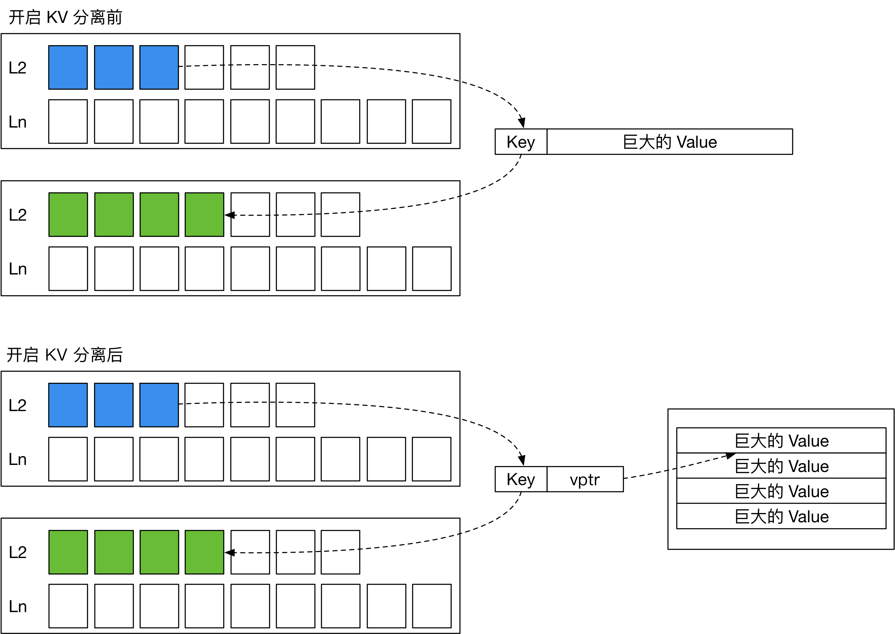
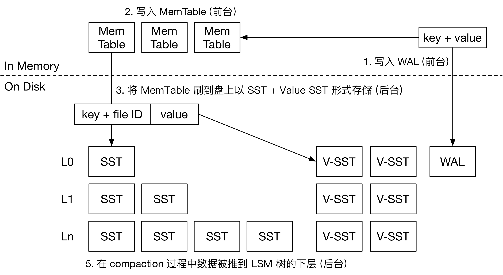
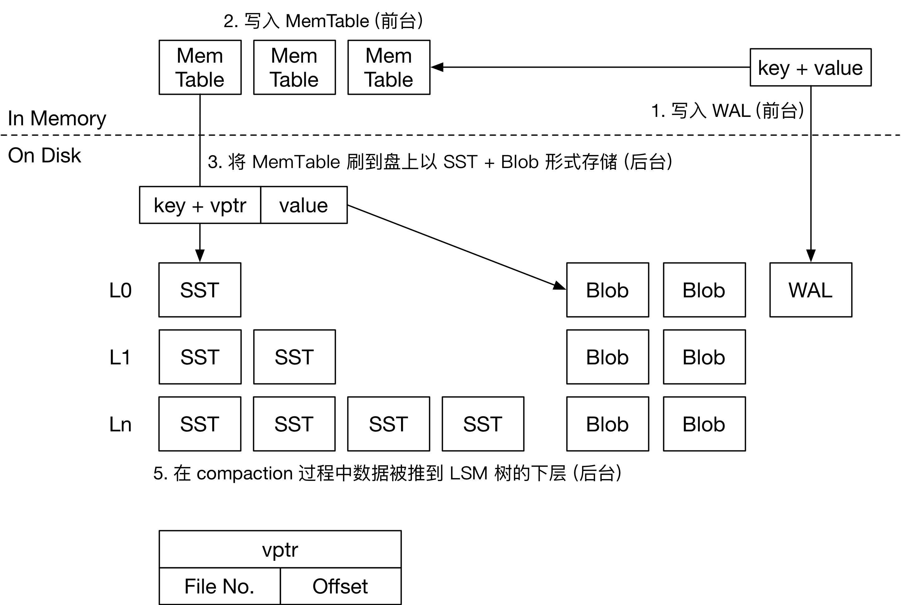

+++
title = "LSM 存储引擎中 KV 分离的实现"
date = "2021-08-07T12:00:00+08:00"
toc = true
+++

常见的 LSM 存储引擎，如 LevelDB 和 RocksDB，将用户写入的一组的 key 和 value 存放在一起，按顺序写入 SST。在 compaction 过程中，引擎将上层的 SST 与下层 SST 合并，产生新的 SST 文件。这一过程中，SST 里面的 key 和 value 都会被重写一遍，带来较大的写放大。如果 value 的大小远大于 key，compaction 过程带来的写放大会引入巨大的开销。

在 WiscKey (FAST '16) 中，作者提出了一种对 SSD 友好的基于 LSM 树的存储引擎设计。它通过 KV 分离降低了 LSM 树的写放大。
KV 分离就是将大 value 存放在其他地方，并在 LSM 树中存放一个 value pointer (vptr) 指向 value 所在的位置。在 WiscKey 中，这个存放 value 的地方被称为 Value Log (vLog)。由此，LSM 树 compaction 时就不需要重写 value，仅需重新组织 key 的索引。这样一来，就能大大减少写放大，减缓 SSD 的磨损。

KV 分离的思路听起来非常简单，但在实际实现时，还需要考虑许多问题：
* vLog 的内容应该如何组织？如何对 vLog 做压缩？
* 用户删除 value 后，如何回收 vLog 中的垃圾？
* 回收垃圾时，如何更新 LSM 树中的 vptr？
* 如何解决 KV 分离带来的 scan 性能影响？
* ……

如今，距离 WiscKey 这篇论文的发布已经过去了五年的时间。工业界中也陆续涌现出了一批 KV 分离的 LSM 存储引擎实现。在这篇文章中，我将介绍三个开源的 KV 分离存储引擎实现，对比它们的不同，从而引出 KV 分离实现过程中的 tradeoff，给读者更多关于大 value 场景下 KV 分离存储引擎选型的启发。

* [BadgerDB](https://github.com/dgraph-io/badger) 是最接近 WiscKey 论文所述的 KV 分离存储引擎。BadgerDB 是 Dgraph 图数据库的存储引擎，使用大道至简 Go 语言编写。
* [TerarkDB](https://github.com/bytedance/terarkdb) 是由 Terark (现已被字节跳动收购) 开发的存储引擎，基于 RocksDB 5.x 开发。TerarkDB 目前已经在字节跳动内部投入使用。
* [Titan](https://github.com/tikv/titan) 是作为 RocksDB 插件提供的存储引擎，兼容 RocksDB 6.x 的所有接口，由 PingCAP 主导开发。Titan 目前已经可以在 TiKV 中使用。

## 写入流程与数据存储 

在本文中，如无特殊说明，我们都假设存储引擎开启 WAL，且 LSM 树使用 Leveled Compaction。

### 常见 LSM 存储引擎的写流程

首先，我们来看看常见的 LSM 存储引擎是如何处理写入请求的。接收到用户的写入请求后，引擎会将这对 key-value 直接写入 Memtable 和 WAL。Memtable 大多采用跳表存储 KV 对。WAL 用于持久化，以便服务器掉电后恢复 Memtable 的信息。自此，即可通知用户写入操作已经持久化。

LSM 引擎的后台操作主要包括两个任务：将 Memtable 刷到盘上 (Flush)，以及对 LSM 树做 compaction。内存中同一时间只有一个正在写入的 Memtable，其他 Memtable 都是不可变的。当内存中 Memtable 超过限制后，引擎会将 Memtable 的内容转换为 SST 刷到盘上，并删除 WAL。SST 就是有序存储 KV 对的文件。SST 中的数据分块存储，按块压缩。在写入 KV 对的内容后，SST 的末尾是若干个索引块，记录每个数据块开头的 key，以便快速定位 key 的位置。SST 中可能含有 Bloom Filter 等结构加速查询。

LSM 树的第 0 层包含多个 SST，SST 的 key 范围可能互相重叠。从 L1 层开始，同一层的 SST key 范围就互不重叠。SST 进入 LSM 树后，会对超过容量限制的层做 compaction。由此，用户写入的 key 和 value 将随着时间的推移逐渐移动到引擎的最下层。

当 LSM 树初始为空时，SST 文件如果从 L0 层一层层 compaction 到最后一层，会引入一些不必要的写放大。因此，大多数 LSM 存储引擎都提供了 compaction-to-Lbase 的功能。在这种情况下，每一层可以容纳的 SST 文件大小都是动态可调的。SST 可能直接从 L0 层刷到 L6 层，从而减少 LSM 树刚开始灌数据时的写放大。

### BadgerDB 的写流程

在 BadgerDB 中，大 value 在用户请求写入时就会直接落入 vLog 中。整个流程如下图所示。

用户请求向 Badger 中写入 KV 对，如果 value 小于阈值，那么整个流程和常见的 LSM 引擎一样。如果 value 大于等于阈值，整个写入流程如下：
* 大 value 首先会被追加到 vLog 中。BadgerDB 中只有一个活跃的 vLog。当一个 vLog 超过设定的大小后，引擎会新建一个文件作为新的 vLog。因此，Badger 使用多个 vLog 文件存储用户写入的大 value。每个 vLog 文件按写入顺序存储用户的大 value 和对应的 key。
* 写入 vLog 后，即可获得该 value 在 vLog 的位置，和 vLog 的编号。BadgerDB 将 `<key, <fileno, offset>>` 作为 KV 对写入 WAL, Memtable 和 LSM 树中，这个流程和常见 LSM 引擎一致。

### TerarkDB 的写流程

由于 TerarkDB 基于 RocksDB 开发，整个写流程在前台阶段和 RocksDB 一致。KV 对被写入 Memtable 和 WAL，然后在引擎后台将 Memtable 刷盘。相对于 Badger 来讲，value 需要在前台被写入 WAL，并且在 Flush 时被写入 v-SST (Value SST)。这个过程引入了额外的一倍写放大。

后台刷盘时，TerarkDB 将 Memtable 根据 value 大小拆分。小 value 和 key 一起打包进 SST，和常见 LSM 引擎一致。大 value 和对应的 key 会被写入 v-SST 中，以 SST 的形式存储。由于 SST 中包含索引块，在查询时可以仅根据 key 迅速定位到 value 的位置，在 LSM 树中，TerarkDB 仅存储大 value 对应的 key，和 value 所在的文件编号，即 `<key, fileno>`，不存储大 value 的 offset。

由于大 value 以 SST 形式存储，TerarkDB 的 大 value 在单 v-SST 中是按 key 排序的。与此同时，借助 RocksDB 已有的工具，TerarkDB 可以对 vSST 做块级别压缩。在这种情况下，TerarkDB 的默认 KV 分离阈值通常设置的比较小，在 512B 左右。而 BadgerDB 则把这个默认值设置为 4K。

### Titan 的写流程

Titan 是 RocksDB 的一个插件，所以整体的前台流程和 RocksDB 几乎一样。后台流程和 TerarkDB 相近，唯一的区别是存储大 value 的方式。Titan 通过特殊的格式 BlobFile 存储大 value。BlobFile 中包含了有序存储的 KV 对，KV 对按单个记录压缩。因此，在 Flush 的过程中，大 value 在 LSM 树中的存储形式为 `<key, <fileno, offset>>`。

## 垃圾回收的实现

Scan 性能，写放大

索引一致性

MVCC，WriteCallback，on-demand

## 读流程的开销与分析

## 总结
