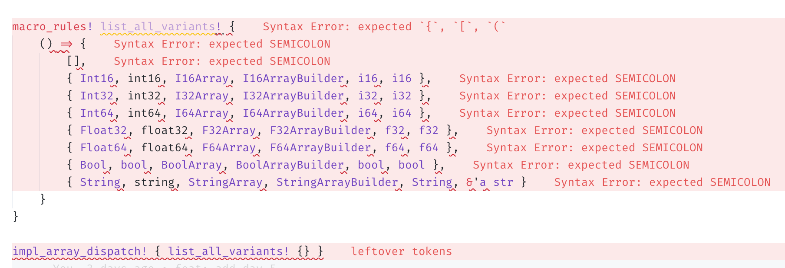

+++
title = "用 Rust 做类型体操 (中篇)"
date = "2022-01-24T23:00:00+08:00"
toc = true
tags = ["Rust", "数据库", "执行器", "类型", "GAT"]
categories = ["Tech"]
+++

TL;DR: 本人前两天刚写的 [type-exercise-in-rust (GitHub)][github] 中已经包含了一整套数据库执行器的类型设计，本文将详细介绍整个设计过程中的思考过程和解决方案。

[github]: https://github.com/skyzh/type-exercise-in-rust

## Day 3: 实现 `ArrayImpl` 等动态调度类型

在 Day 3-4 中，我们要考虑一件事情：数据库系统在编译期是不可能知道每个从存储、从网络上传过来的 Array 是什么类型的。我们需要给 Array 提供动态分发的功能。

```rust
fn eval_binary(i1: Box<dyn Array> i2: Box<dyn Array>) -> Box<dyn Array> {
  /* some black magic */
}
```

说到动态分发，同学们一定会立刻想到用 `Box<dyn Array>` 来表示 Array 的动态类型。可惜的是，`Array` trait 在历经 Day 0, 1, 2 的类型体操之后，已经不符合 object safety 了。

如果一个 trait 可以被包裹成一个动态分发的对象（如 `Box<dyn Array>`），编译器会给 `dyn Array` 实现 `Array` trait。我们看看现在的 `Array` trait 长啥样：

```rust
/// [`Array`] is a collection of data of the same type.
pub trait Array /* 省略一些 bound */ {
    /// Retrieve a reference to value.
    fn get(&self, idx: usize) -> Option<Self::RefItem<'_>>;

    /// Number of items of array.
    fn len(&self) -> usize;

    /// Indicates whether this array is empty
    fn is_empty(&self) -> bool {
        self.len() == 0
    }

    /// Get iterator of this array.
    fn iter(&self) -> ArrayIterator<Self>;
}
```

对于 `Int32Array`，`get` 返回 `Option<i32>` 参数；而对于 `StringArray`, `get` 返回 `Option<&str>` 参数。因此，这个 trait 是不可能给 `dyn Array` 实现的——根本没有统一的签名能够实现。

因此，我们考虑使用 `enum` 来做 dispatch：

```rust
pub enum ArrayImpl {
    Int32(I32Array),
    Float32(F32Array),
    String(StringArray),
}
```

这时同学们一定有想问：既然是 enum，为啥不用 [enum_dispatch](https://crates.io/crates/enum_dispatch) 这个库捏？

enum_dispatch 也会自动为 ArrayImpl 这个 enum 类型实现 `Array` trait，但上面的一通分析表明这是不可能的，所以我们要自己亲自动手实现。

### ArrayImpl 的函数签名

`ArrayImpl` 实现的 `get` 函数，究竟用什么签名比较好呢？

```rust
impl ArrayImpl {
  fn get(&self, idx: usize) -> Option</* ??? */>;
}
```

考虑到这里只能填单个类型，我们把 `Scalar`, `ScalarRef` 也做一整套 enum 出来：

```rust
/// Encapsules all variants of [`Scalar`]
pub enum ScalarImpl {
    Int32(i32),
    Float32(f32),
    String(String),
}

/// Encapsules all variants of [`ScalarRef`]
pub enum ScalarRefImpl<'a> {
    Int32(i32),
    Float32(f32),
    String(&'a str),
}
```

这样，`ArrayImpl` 就可以用这个签名了：

```rust
impl ArrayImpl {
  fn get(&self, idx: usize) -> Option<ScalarRefImpl<'_>>;
}
```

### 实现 `TryFrom` 和 `Into` trait

接下来的目标就是在泛型函数中将 `ArrayImpl` 转换成一个 generic 类型。

```rust
fn eval_binary<I1: Array, I2: Array>(i1: &ArrayImpl, i2: &ArrayImpl) -> Result<ArrayImpl> {
    let i1: &I1 = i1.try_into()?;
    let i2: &I2 = i2.try_into()?;
    /* some black magic */
}
```

这就要求我们给 `Array` 加上 `TryFrom` 和 `Into` 的 bound。

```rust
pub trait Array: Send + Sync + Sized + 'static + TryFrom<ArrayImpl> + Into<ArrayImpl>
where
    for<'a> Self::OwnedItem: Scalar<RefType<'a> = Self::RefItem<'a>>,
{
```

简单实现一下各个 `Array` 的 `TryFrom` 和 `ArrayImpl` 的 `From`，带上这个 bound 就可以编译通过了。实现的方式就是 match `ArrayImpl` 的 enum variant，然后分别做 dispatch。这里又会碰到 `PrimitiveArray` blanket implementation 导致的类型不匹配的坑，记得要给 `PrimitiveArray` 多加两个 bound: `Into<ArrayImpl>` 和 `TryFrom<ArrayImpl>`

```rust
impl<T> Array for PrimitiveArray<T>
where
    T: PrimitiveType,
    T: Scalar<ArrayType = Self>,
    for<'a> T: ScalarRef<'a, ScalarType = T, ArrayType = Self>,
    for<'a> T: Scalar<RefType<'a> = T>,
    Self: Into<ArrayImpl>,
    Self: TryFrom<ArrayImpl>,
{
```

### 表达 `ArrayImpl` 引用的 `TryFrom` bound

回顾一下之前 `eval_binary` 的签名：

```rust
fn eval_binary<I1: Array, I2: Array>(i1: &ArrayImpl, i2: &ArrayImpl) -> Result<ArrayImpl> {
    let i1: &I1 = i1.try_into()?;
    let i2: &I2 = i2.try_into()?;
    /* some black magic */
}
```

等等，好像有点不太对：这里要求的是 `&Array: TryFrom<&ArrayImpl>`，而不是 `Array: TryFrom<ArrayImpl>`。如何表达 `Array` 的引用有 `TryFrom` 的性质呢？

再次结合之前 Day 2 的经验，我们可以用 [HRTB](https://doc.rust-lang.org/nomicon/hrtb.html) 来表示这个性质：

```rust
pub trait Array: Send + Sync + Sized + 'static + TryFrom<ArrayImpl> + Into<ArrayImpl>
where
    for<'a> Self::OwnedItem: Scalar<RefType<'a> = Self::RefItem<'a>>,
    for<'a> &'a Self: TryFrom<&'a ArrayImpl>
{
```

加好以后，诶，为什么编译过不了了？编译器报了 15 个错，都是在使用 `Array` 的地方：

```plain
error[E0277]: the trait bound `for<'a> &'a A: From<&'a array::ArrayImpl>` is not satisfied
   --> archive/day3/src/array/iterator.rs:8:33
    |
8   | pub struct ArrayIterator<'a, A: Array> {
    |                                 ^^^^^ the trait `for<'a> From<&'a array::ArrayImpl>` is not implemented for `&'a A`
    |
    = note: required because of the requirements on the impl of `for<'a> Into<&'a A>` for `&'a array::ArrayImpl`
note: required because of the requirements on the impl of `for<'a> TryFrom<&'a array::ArrayImpl>` for `&'a A`
   --> archive/day3/src/scalar.rs:185:10
    |
185 | impl<'a> TryFrom<ScalarRefImpl<'a>> for &'a str {
    |          ^^^^^^^^^^^^^^^^^^^^^^^^^^     ^^^^^^^
note: required by a bound in `array::Array`
   --> archive/day3/src/array.rs:24:23
    |
21  | pub trait Array: Send + Sync + Sized + 'static + TryFrom<ArrayImpl> + Into<ArrayImpl>
    |           ----- required by a bound in this
...
24  |     for<'a> &'a Self: TryFrom<&'a ArrayImpl>
    |                       ^^^^^^^^^^^^^^^^^^^^^^ required by this bound in `array::Array`
help: consider introducing a `where` bound, but there might be an alternative better way to express this requirement
    |
8   | pub struct ArrayIterator<'a, A: Array> where &'a A: for<'a> From<&'a array::ArrayImpl> {
    |                                        +++++++++++++++++++++++++++++++++++++++++++++++
```

给 `Array` 加上这个 bound，会导致我们需要在所有用到 `Array` 的地方都写上 `where &'a A: for<'a> From<&'a array::ArrayImpl>`。这样就给使用者造成了很大的负担：开发者明明只想用 `Array` 来写一些泛型 SQL scalar 函数，结果每次写的时候都要带上一大堆 trait bound，这简直是徒增开发难度！

怎么办呢？考虑到几个点：
* 开发者一般只需要实现原始类型的泛型函数。
* 运行时的类型转换由向量化框架来做。

这么一想，那其实在我们表达式框架的内部要求这个 bound 是最好的解决方案了。

去掉 `Array` 上的 `TryFrom` bound，把它写在 `eval_binary` 上：

```rust
fn eval_binary<'a, I1: Array, I2: Array>(
    i1: &'a ArrayImpl,
    i2: &'a ArrayImpl,
) -> Result<ArrayImpl, ()>
where
    &'a I1: TryFrom<&'a ArrayImpl, Error = ()>,
    &'a I2: TryFrom<&'a ArrayImpl, Error = ()>,
{
    let i1: &'a I1 = i1.try_into()?;
    let i2: &'a I2 = i2.try_into()?;
    todo!()
}
```

然后，编译通过，Part 3 就结束了！

## Day 4: Macro 生成 boilerplate code

随着我们的 `Array` 类型越来越多，我们需要手写的代码也越来越多。比如 `ArrayImpl::get`：

```rust
impl ArrayImpl {
    pub fn get(&self, idx: usize) -> Option<ScalarRefImpl<'_>> {
        match self {
            Self::Int32(a) => a.get(idx).map(ScalarRefImpl::Int32),
            Self::Int64(a) => a.get(idx).map(ScalarRefImpl::Int64),
            Self::Float32(a) => a.get(idx).map(ScalarRefImpl::Float32),
            // 每添加一个类型就要多写一个 arm ...
        }
    }
}
```

包括 `TryFrom`, `len` 等等函数，也需要我们手动实现动态分发。

有没有什么办法可以写一次就自动给所有类型生成相关的动态分发代码呢？聪明的你一定想到了用宏展开来解决：

```rust
/// Implements dispatch functions for [`Array`]
macro_rules! impl_array_dispatch {
    ($( { $Abc:ident, $abc:ident, $AbcArray:ty, $AbcArrayBuilder:ty, $Owned:ty, $Ref:ty } ),*) => {
        impl ArrayImpl {
            /// Get the value at the given index.
            pub fn get(&self, idx: usize) -> Option<ScalarRefImpl<'_>> {
                match self {
                    $(
                        Self::$Abc(array) => array.get(idx).map(ScalarRefImpl::$Abc),
                    )*
                }
            }
        }
    }
}

impl_array_dispatch! {
    { Int32, int32, Int32Array, Int32ArrayBuilder, i32, i32 },
    { Int64, int64, Int64Array, Int64ArrayBuilder, i64, i64 },
    { String, string, StringArray, StringArrayBuilder, String, &'a str },
    // ...
}
```

问题来了：我们的 `impl_array_dispatch` macro 肯定是到处都有——有的用来 impl `TryFrom` for `ArrayImpl`, 有的用来 impl `ArrayImpl`。如果我们有多个这样的 macro，macro 展开的参数 `{ Int32, int32, Int32Array, Int32ArrayBuilder, i32, i32 }` 也要写很多份。

```rust
impl_array_dispatch! {
    { Int32, int32, Int32Array, Int32ArrayBuilder, i32, i32 },
    { Int64, int64, Int64Array, Int64ArrayBuilder, i64, i64 },
    { String, string, StringArray, StringArrayBuilder, String, &'a str },
    // ...
}

impl_array_try_from! {
    { Int32, int32, Int32Array, Int32ArrayBuilder, i32, i32 },
    { Int64, int64, Int64Array, Int64ArrayBuilder, i64, i64 },
    { String, string, StringArray, StringArrayBuilder, String, &'a str },
    // ...
}

// ...
```

有什么办法可以解决这个问题呢？试试 macro 能不能传 macro 参数进去：

```rust
macro_rules! list_all_variants! {
    () => {
        { Int16, int16, I16Array, I16ArrayBuilder, i16, i16 },
        { Int32, int32, I32Array, I32ArrayBuilder, i32, i32 },
        { Int64, int64, I64Array, I64ArrayBuilder, i64, i64 },
        { Float32, float32, F32Array, F32ArrayBuilder, f32, f32 },
        { Float64, float64, F64Array, F64ArrayBuilder, f64, f64 },
        { Bool, bool, BoolArray, BoolArrayBuilder, bool, bool },
        { String, string, StringArray, StringArrayBuilder, String, &'a str }
    }
}

impl_array_dispatch! { list_all_variants! {} }
```

紧接着编译器报了一堆错，五彩缤纷：



这是为什么捏？

这就要从 Rust macro 的执行方式讲起了。我们用正常的 Rust 程序来打个比方：

```rust
fn list_all_variants() -> Vec<Variants>;
fn impl_array_dispatch(data: Vec<Variants>) -> GeneratedCode;

impl_array_dispatch(list_all_variants());
```

对于 Rust 程序来说，执行的方法是先调用 `list_all_variants()` 获得返回值，然后把这个返回值交给 `impl_array_dispatch` 来继续执行，由里到外展开。

对于 Rust macro 来说，情况就截然相反：

```rust
impl_array_dispatch! { list_all_variants! {} }
```

在这里，Rust 编译时先尝试展开 `impl_array_dispatch` 这个 macro。此时，`list_all_variants! {}` 这些 token 会作为 macro 的参数传进去。但我们需要的是符合 `$( { $Abc:ident, $abc:ident, $AbcArray:ty, $AbcArrayBuilder:ty, $Owned:ty, $Ref:ty } ),*` 的一个参数，`list_all_variants! {}` 这四个 token 显然不满足 `impl_array_dispatch` macro 需要的参数。

怎么在这种由外到里展开的顺序里面实现宏代码的复用呢？我拍脑袋想出了一种聪明的办法：

```rust
/// `for_all_variants` includes all variants of our array types. If you added a new array
/// type inside the project, be sure to add a variant here.
///
/// Every tuple has four elements, where
/// `{ enum variant name, function suffix name, array type, builder type, scalar type }`
macro_rules! for_all_variants {
    ($macro:tt) => {
        $macro! {
            { Int16, int16, I16Array, I16ArrayBuilder, i16, i16 },
            { Int32, int32, I32Array, I32ArrayBuilder, i32, i32 },
            { Int64, int64, I64Array, I64ArrayBuilder, i64, i64 },
            { Float32, float32, F32Array, F32ArrayBuilder, f32, f32 },
            { Float64, float64, F64Array, F64ArrayBuilder, f64, f64 },
            { Bool, bool, BoolArray, BoolArrayBuilder, bool, bool },
            { String, string, StringArray, StringArrayBuilder, String, &'a str }
        }
    };
}

for_all_variants! { impl_array_builder_dispatch }
```

这样一来，Rust 先展开 `for_all_variants`，得到：

```rust
impl_array_builder_dispatch! {
    { Int16, int16, I16Array, I16ArrayBuilder, i16, i16 },
    { Int32, int32, I32Array, I32ArrayBuilder, i32, i32 },
    { Int64, int64, I64Array, I64ArrayBuilder, i64, i64 },
    { Float32, float32, F32Array, F32ArrayBuilder, f32, f32 },
    { Float64, float64, F64Array, F64ArrayBuilder, f64, f64 },
    { Bool, bool, BoolArray, BoolArrayBuilder, bool, bool },
    { String, string, StringArray, StringArrayBuilder, String, &'a str }
}
```

这和我们在最开始手敲这些类型声明时的 macro 代码一摸一样。

所以，通过调换 `impl_array_builder_dispatch` 和模版 `for_all_variants` 的内外位置关系，我们就做到了 `for_all_variants` 内部信息的复用。这样以来，我们就可以到处实现动态分发的函数了：

```rust
for_all_variants! { impl_array_builder_dispatch }
for_all_variants! { impl_array_try_from }
for_all_variants! { impl_scalar_try_from }
// ...
```

于是乎，我们的 `ArrayImpl` 可以在修改少量代码（往 `for_all_variants` 里面加一条记录）的情况下支持越来越多的类型。Day 4 也结束了！

### 思考题

在本系列中，我们通过 `ArrayImpl` 来做动态分发。是否可以用 `pub struct BoxedArray(Box<dyn Any>)` 来做动态分发？

答案是可以，我们可以有很多种做法：
* 使用 `Any` 的 `TypeId` 替代 `ArrayImpl::XXX` 来判断应该 downcast 到什么类型，然后分发。
* 为 Array 实现一套新的 trait：`ArrayDispatch`，里面加一个 `array_type(&self) -> ArrayTypeEnum` 函数。定义 `pub struct BoxedArray(Box<dyn ArrayDispatch>)`，通过 `array_type` 来决定 downcast 到什么类型。

## Day 5: 表达式向量化 (上)

经过了整整四天的类型体操，我们终于可以做表达式向量化了：

```rust
let expr = BinaryExpression::<StringArray, StringArray, BoolArray, _>::new(str_contains);
// We only need to pass `ArrayImpl` to the expression, and it will do everything for us,
// including type checks, loopping, etc.
let result = expr.eval(/* &ArrayImpl,  &ArrayImpl */).unwrap();
```

`BinaryExpression` 的向量化代码非常好写：

```rust
impl<I1: Array, I2: Array, O: Array> BinaryExpression<I1, I2, O>
{
    /// Evaluate the expression with the given array.
    pub fn eval<'a>(&self, i1: &'a ArrayImpl, i2: &'a ArrayImpl) -> Result<ArrayImpl> {
        let i1a: &'a I1 = i1.try_into()?;
        let i2a: &'a I2 = i2.try_into()?;
        assert_eq!(i1.len(), i2.len(), "array length mismatch");
        let mut builder: O::Builder = O::Builder::with_capacity(i1.len());
        for (i1, i2) in i1a.iter().zip(i2a.iter()) {
            match (i1, i2) {
                (Some(i1), Some(i2)) => builder.push(Some((self.func)(i1, i2).as_scalar_ref())),
                _ => builder.push(None),
            }
        }
        Ok(builder.finish().into())
    }
}
```

但主要问题是：

* `BinaryExpression` 结构体应该怎么定义？
* `self.func` 应该是什么类型？

先考虑结构体怎么定义。理论上结构体里面只要存一个函数对象 (比如 `str_contains`) 就行了。

```rust
pub struct BinaryExpression<I1: Array, I2: Array, O: Array, F> {
    func: F,
}
```

编译器无情打脸：

```plain
error[E0392]: parameter `O` is never used
  --> archive/day5/src/expr.rs:23:51
   |
23 | pub struct BinaryExpression<I1: Array, I2: Array, O: Array, F> {
   |                                                   ^ unused parameter
   |
   = help: consider removing `O`, referring to it in a field, or using a marker such as `PhantomData`
   = help: if you intended `O` to be a const parameter, use `const O: usize` instead
```

`PhantomData` 是个啥？这个和协变与 drop checker 有关，这里不再深入。总之，根据编译器的提示，我们需要把这些 generic parameter 都加进结构体：

```rust
pub struct BinaryExpression<I1: Array, I2: Array, O: Array, F> {
    func: F,
    _phantom: PhantomData<(I1, I2, O)>,
}
```

接下来考虑 `func` 的类型。想到 `str_contains` 函数的签名：

```rust
pub fn str_contains(i1: &str, i2: &str) -> bool {
    i1.contains(i2)
}
```

推广之，则可以写出对应的 Fn trait：

```rust
F: Fn(I1::RefItem<'a>, I2::RefItem<'a>) -> O::OwnedItem
```

在 `impl BinaryExpression` 的时候，我们必然要提供一个 lifetime parameter。这个参数可以在 impl 的时候指定：

```rust
impl<'a, I1: Array, I2: Array, O: Array, F> BinaryExpression<I1, I2, O, F>
where
    &'a I1: TryFrom<&'a ArrayImpl, Error = TypeMismatch>,
    &'a I2: TryFrom<&'a ArrayImpl, Error = TypeMismatch>,
    F: Fn(I1::RefItem<'a>, I2::RefItem<'a>) -> O::OwnedItem,
{
    pub fn new(func: F) -> Self {
        Self {
            func,
            _phantom: PhantomData,
        }
    }
    
    // ...
}
```

最后跑一下编译测试：

```rust
#[test]
fn test_str_contains() {
    let expr = BinaryExpression::<StringArray, StringArray, BoolArray, _>::new(str_contains);
    let result = expr.eval(&test_array(), &test_array()).unwrap();
}
```

大功告成！通过一个简单的 `BinaryExpression` struct，我们就可以直接将普通函数向量化了。

## Day 6: 表达式向量化 (下)

事情往往没有这么简单。在实际的表达式执行中，开发者通常会写出这样的逻辑：

* 根据收到的 SQL Plan 创建表达式对象。
* 从存储捞 Array 然后执行表达式。

写成 Rust 代码，大概是这个样子：

```rust
let expr = build_expression(prost_message);
let l = storage.get_data();
let r = storage.get_data();
let result = expr.eval(&l, &r).unwrap();
```

这个 `build_expression` 函数应该怎么写捏？我们以返回向量化 `cmp_ge` 函数的表达式为例：

```rust
/// Return if `i1 > i2`. Note that `i1` and `i2` could be different types. This
/// function will automatically cast them into `C` type.
///
/// * `I1`: left input type.
/// * `I2`: right input type.
/// * `C`: cast type.
pub fn cmp_ge<'a, I1: Array, I2: Array, C: Array + 'static>(
    i1: I1::RefItem<'a>,
    i2: I2::RefItem<'a>,
) -> bool
where
    I1::RefItem<'a>: Into<C::RefItem<'a>>,
    I2::RefItem<'a>: Into<C::RefItem<'a>>,
    C::RefItem<'a>: PartialOrd,
{
    i1.into().partial_cmp(&i2.into()).unwrap() == Ordering::Greater
}

fn create_expression(
) -> BinaryExpression<StringArray, StringArray, BoolArray, impl Fn(&str, &str) -> bool> {
    BinaryExpression::<StringArray, StringArray, BoolArray, _>::new(
        cmp_ge::<StringArray, StringArray, StringArray>,
    )
}
```

尝试编译一下，编译器报了一个神奇的错：

```plain
error: implementation of `FnOnce` is not general enough
   --> archive/day5/src/expr.rs:101:10
    |
101 |     ) -> BinaryExpression<StringArray, StringArray, BoolArray, impl Fn(&str, &str) -> bool> {
    |          ^^^^^^^^^^^^^^^^^^^^^^^^^^^^^^^^^^^^^^^^^^^^^^^^^^^^^^^^^^^^^^^^^^^^^^^^^^^^^^^^^^ implementation of `FnOnce` is not general enough
    |
    = note: `fn(<string_array::StringArray as array::Array>::RefItem<'_>, <string_array::StringArray as array::Array>::RefItem<'_>) -> bool {expr::cmp::cmp_ge::<'_, string_array::StringArray, string_array::StringArray, string_array::StringArray>}` must implement `FnOnce<(&str, &'0 str)>`, for any lifetime `'0`...
    = note: ...but it actually implements `FnOnce<(&'1 str, &'1 str)>`, for some specific lifetime `'1`
```

而如果是直接调用不带泛型的标量函数（比如 `str_contains`）：

```rust
fn create_expression(
) -> BinaryExpression<StringArray, StringArray, BoolArray, impl Fn(&str, &str) -> bool> {
    BinaryExpression::<StringArray, StringArray, BoolArray, _>::new(str_contains)
}
```

则一点问题也没有。

为什么捏？感觉这就和 GAT 下的生命周期表达有关系了。

首先分析一下编译错误信息，对于 `cmp_ge` 的报错，

```plain
= note: `fn(<string_array::StringArray as array::Array>::RefItem<'_>, <string_array::StringArray as array::Array>::RefItem<'_>) -> bool {expr::cmp::cmp_ge::<'_, string_array::StringArray, string_array::StringArray, string_array::StringArray>}` must implement `FnOnce<(&str, &'0 str)>`, for any lifetime `'0`...
    = note: ...but it actually implements `FnOnce<(&'1 str, &'1 str)>`, for some specific lifetime `'1`
```

意思是 `cmp_ge` 的两个参数，生命周期是**一个**指定的 `'a`；而这里如果要作为 `create_expression` 的返回值，要求 `cmp_ge` 对于所有生命周期都成立。

也就是说，对于 `contains_str` 这个函数，编译器可以在任何地方都推导出它对于所有生命周期都成立；而对于 `cmp_ge` 这个函数，编译器在函数体返回值的地方无法推导出它对于所有生命周期都成立，于是给它绑定了一个特定的生命周期 `'a`。感觉这是一个比较难解决的编译器 bug。

那我们能不能把这个 `for<'a>` 的性质强行写进函数签名里呢？

```rust
fn create_expression(
) -> BinaryExpression<StringArray, StringArray, BoolArray, impl Fn(&str, &str) -> bool> {
    /* NOTE: THIS CODE WON'T COMPILE! */
    BinaryExpression::<for<'a>, StringArray, StringArray, BoolArray, _>::new(str_contains)
}
```

很显然，Rust 没法表达这种性质。因此，我们必须想办法把 `BinaryExpression` 里面的生命周期去掉，从而在这里让编译器能够推导出 `cmp_ge` 这个泛型函数对“所有生命周期”都成立。

在 type-exercise 仓库里，我提供了两种办法：

* the easy way -- 把所有函数都实现成结构体，函数体内的生命周期和 `&self` 一致，规避这些问题。缺点是开发者得把所有标量函数写成结构体，有点麻烦。
* the hard way -- 想办法证明所有的符合签名的标量函数都有 “for all lifetime” 的性质。

这篇文章就会着重分析如何一步步证明函数的性质，并去掉生命周期。

### 证明泛型标量函数对所有生命周期成立

在实现 `cmp_ge` 的时候，有一个很讨厌的点：

```rust
fn cmp_ge<'a, I1: Array, I2: Array, C: Array + 'static>(
    i1: I1::RefItem<'a>,
    i2: I2::RefItem<'a>,
) -> bool
```

为了写出 i1, i2 的类型，不得不在 generic parameter 里面加一个 `'a`。就是这个 `'a` 成为了痛苦的根源。

如何抹掉这个生命周期呢？一拍脑袋能想到的办法就是用一个 trait 作为桥梁，抹平这个生命周期，并且证明 `cmp_ge` 对于所有生命周期都成立。

```rust
/// A trait over all scalar SQL functions.
///
/// It takes `A` and `B` as input prameter, and outputs scalar of type `O`.
pub trait BinaryExprFunc<A: Scalar, B: Scalar, O: Scalar> {
    /// Evaluate a binary function with two references to data.
    fn eval(&self, i1: A::RefType<'_>, i2: B::RefType<'_>) -> O;
}
```

这个 trait 的定义里面完全没有生命周期，这也意味着向量化的时候直接写：

```rust
impl<I1, I2, O, F> BinaryExpression<I1, I2, O, F>
where
    O: Scalar,
    I1: Scalar,
    I2: Scalar,
    F: BinaryExprFunc<I1, I2, O>,
{
    // ...
}
```

即可。无需给 `F` 提供生命周期的参数，定义里面也不出现任何生命周期。

那么怎么证明 `BinaryExprFunc` 对于标量函数成立呢？比如我们能不能通过类似于宏展开的方法，做这样的事情：

```rust
impl BinaryExprFunc for str_contains {
    // ...
}
```

这是不可能的。在 Rust 里，一个函数就是一个对象。它的类型是写不出来的。而 `impl Trait for Type` 的语法，要求最后这个位置是一个 Type。在这种情况下，我们只能做 blanket implementation：

```rust
/// Blanket implementation for all binary expression functions
impl<A: Scalar, B: Scalar, O: Scalar, F> BinaryExprFunc<A, B, O> for F
where
    F: Fn(A::RefType<'_>, B::RefType<'_>) -> O,
{
    fn eval(&self, i1: A::RefType<'_>, i2: B::RefType<'_>) -> O {
        self(i1, i2)
    }
}
```

为所有符合 `Fn(A::RefType<'_>, B::RefType<'_>) -> O` 条件的标量函数都实现 `BinaryExprFunc`。

这么一个桥梁 trait 实现完以后，我们先验证一下已有的几个标量函数是否能够匹配上：

```rust
// 一个类似 str_contains 的函数
fn binary_str(_: &str, _: &str) -> String {
    todo!()
}

// 一个类似 cmp_ge 的函数
fn binary_generics<A: Scalar, B: Scalar, O: Scalar>(_: A::RefType<'_>, _: B::RefType<'_>) -> O {
    todo!()
}

// 用于验证一个函数是否 impl 某个 trait
fn test_if_impl<A: Scalar, B: Scalar, O: Scalar, F: BinaryExprFunc<A, B, O>>(_: F) {}

#[test]
fn test_simple_generics_function() {
    test_if_impl::<i32, f32, i64, _>(binary_generics::<i32, f32, i64>);
    test_if_impl::<String, String, String, _>(binary_str);
}
```

编译通过！说明我们的 trait `BinaryExprFunc` 架起了标量函数和向量化结构体的桥梁，证明了类似于 `cmp_ge` 的泛型函数对于**所有生命周期**都成立。接下来，向量化就好写多了。

### 实现新的标量函数

回过来看 `cmp_ge`，它需要支持把用户输入的类型 cast 到新的类型以后再比较。

```rust
pub fn cmp_ge<I1: Scalar, I2: Scalar, C: Scalar>(i1: I1::RefType<'_>, i2: I2::RefType<'_>) -> bool
where
    /* ??? */
{
    i1.into().partial_cmp(&i2.into()).unwrap() == Ordering::Greater
}
```

这里的 where bound 应该怎么写呢？有了之前写 HRTB 的经验，我们可以很方便地写出：

```rust
pub fn cmp_ge<I1: Scalar, I2: Scalar, C: Scalar>(i1: I1::RefType<'_>, i2: I2::RefType<'_>) -> bool
where
    for<'a> I1::RefType<'a>: Into<C::RefType<'a>>,
    for<'a> I2::RefType<'a>: Into<C::RefType<'a>>,
    for<'a> C::RefType<'a>: PartialOrd,
{
    i1.into().partial_cmp(&i2.into()).unwrap() == Ordering::Greater
}
```

编译器又一次无情报错：

```rust
error[E0623]: lifetime mismatch
  --> archive/day6-hard/src/expr/cmp.rs:42:8
   |
34 | pub fn cmp_ge<I1: Scalar, I2: Scalar, C: Scalar>(i1: I1::RefType<'_>, i2: I2::RefType<'_>) -> bool
   |                                                      ---------------      --------------- these two types are declared with different lifetimes...
...
42 |     i1.into().partial_cmp(&i2.into()).unwrap() == Ordering::Greater
   |        ^^^^ ...but data from `i2` flows into `i1` here
```

这是为什么捏？我们都证明了
* 对于所有生命周期，I1 的引用可以转化为 C 的引用
* 对于所有生命周期，I2 的引用可以转化为 C 的引用
* 对于所有生命周期，C 实现了 PartialOrd

等等，好像还差一步：不同生命周期的 C 应该如何比较？`I1::RefItem<'_>, I2::RefItem<'_>` 经过 desugar 以后实际上是：

```rust
pub fn cmp_ge<'a, 'b, I1: Scalar, I2: Scalar, C: Scalar>(i1: I1::RefType<'a>, i2: I2::RefType<'b>) -> bool
```

它们的生命周期是不一样的。而我们只证明了：

* `I1::RefType<'a>: Into<C::RefType<'a>>` -- I1 的引用可以转化为**相同生命周期的** C 的引用
* `I2::RefType<'b>: Into<C::RefType<'b>>` -- I2 的引用可以转化为**相同生命周期的** C 的引用

却没有证明：

* `C::RefType<'a>: PartialOrd<C::RefType<'b>>` -- 不同生命周期的 `C` 可以比较。

这该怎么办捏？先试着用 HRTB 写一下 `for<'a> C::RefType<'a>: PartialOrd` 这个 bound。

```rust
pub fn cmp_ge<I1: Scalar, I2: Scalar, C: Scalar>(i1: I1::RefType<'_>, i2: I2::RefType<'_>) -> bool
where
    for<'a> I1::RefType<'a>: Into<C::RefType<'a>>,
    for<'a> I2::RefType<'a>: Into<C::RefType<'a>>,
    for<'a, 'b> C::RefType<'a>: PartialOrd<C::RefType<'b>>,
{
    i1.into().partial_cmp(&i2.into()).unwrap() == Ordering::Greater
}
```

验证一下 `cmp_ge` 有没有匹配上 `BinaryExprFunc` 这个 bound：

```rust
fn test_cmp_ge() {
    test_if_impl::<i32, i64, bool, _>(cmp_ge::<i32, i64, i64>);
    test_if_impl::<String, String, bool, _>(cmp_ge::<String, String, String>);
}
```

编译通过！

但如果要实现 `cmp_eq`，对于 `Eq` 这种 bound 怎么办捏？根据 `Eq` trait 的定义：

```rust
pub trait Eq: PartialEq<Self> { }
```

`Eq` 根本没有给我们提供指定 `Rhs` 的机会！这里直接写死了 `Rhs = Self`。这就意味着，我们必须找一种办法把 `i1` `i2` 两个变量的生命周期统一起来。这该怎么办？

*注：实际上 PartialEq 是可以指定 Rhs 的，这里只是用类似于 Eq 这样的 trait 举个例子，毕竟有很多其他的 trait 是不提供 Rhs 的，但开发者往往会用到……*

### 协变与逆变

简单来说，如果我们写一个正常的函数：

```rust
fn cmp_eq(i1: &i32, i2: &i32) -> bool {
  i1 == i2
}
```

在 `i1 == i2` 的时候，编译器会自动把它们的生命周期统一。因为 `&'a T` 关于 `'a` 是协变的 (covariant) (其他规则见 [Subtyping and Variance - The Rustonomicon](https://doc.rust-lang.org/nomicon/subtyping.html))。因此，编译器在 `i1 == i2` 的地方把长的生命周期缩短，以让 `i1: &i32, i2: &i32` 符合 `PartialEq<i32>` 的签名：

```rust
pub trait PartialEq<Rhs = Self> 
    fn eq(&self, other: &Rhs) -> bool; // &self 和 &Rhs 生命周期需要**相同**
}
```

那么什么是逆变捏？举个例子：

```rust
fn test_func<'short>(i1: &'short i32, i2: &'short i32) {}
```

调用 `test_func` 的时候，`i1` `i2` 的生命周期可能不同：

```rust
fn another_test_func(outer: &i32) {
    let val = 2333
    let inner = &val;
    test_func(inner, outer);
}
```

此时 `inner` 的生命周期必然比 `outer` 短。编译器决定 `test_func` 的 `'short` 就是 `inner` 的生命周期，然后将长的生命周期 `outer` 变成短的。所以对于 `&'long i32` 这个类型来说，它可以把生命周期变短，这叫协变；对于 `fn<'short>(&'short i32, &'short i32)` 来说，它可以接收生命周期比 `&'short i32` 更长的变量，也就是将函数的签名变成 `fn<'short, 'long: 'short>(&'short i32, &'long i32)`。这就叫逆变。

以上分析纯属我瞎扯，具体编译器是怎么实现的请阅读 [Variance of type and lifetime parameters - Guide to Rustc Development](https://rustc-dev-guide.rust-lang.org/variance.html)。我不是类型论专家，上面可能有口误之处，见谅。

协变和逆变都解释完了，这和 GAT 又有什么关系捏？

### 实现 GAT 的生命周期转化

回到 `Scalar` trait 的声明。对于 GAT 类型 `RefType` 来说：

```rust
pub trait Scalar /* 省略 */ {
    type RefType<'a> /* 省略 bound */;
}
```

`i32::RefType<'short>` 和 `i32::RefType<'long>` 之间是不能自动转换的：GAT 类型不是协变的！

这就意味着我们要手动实现生命周期之间的转换。根据 [dtolnay 大佬的建议](https://internals.rust-lang.org/t/variance-of-lifetime-arguments-in-gats/14769/19)，我们给 `Scalar` 加上一个 `upcast_gat` 函数：

```rust
pub trait Scalar /* ... */ {
    /* ... */
    fn upcast_gat<'short, 'long: 'short>(long: Self::RefType<'long>) -> Self::RefType<'short>;
}
```

这样一来，我们就可以在泛型函数里把 `Scalar::RefType<'long>` 转换为 `Scalar::RefType<'short>` 了，相当于手动实现了 GAT 关于生命周期的协变。

随手 impl 一下各个类型的 `upcast_gat`：

```rust
impl Scalar for String {
    fn upcast_gat<'short, 'long: 'short>(long: &'long str) -> &'short str {
        long
    }
}

impl Scalar for $Owned {
    fn upcast_gat<'short, 'long: 'short>(long: $Owned) -> $Owned {
        long
    }
}
```

现在就可以自如转换了！

### 重新实现新的标量函数

有了 `upcast_gat` 之后，`PartialOrd` 的 bound 就不用把 `Rhs` 写出来了：

```rust
pub fn cmp_ge<I1: Scalar, I2: Scalar, C: Scalar>(i1: I1::RefType<'_>, i2: I2::RefType<'_>) -> bool
where
    for<'a> I1::RefType<'a>: Into<C::RefType<'a>>,
    for<'a> I2::RefType<'a>: Into<C::RefType<'a>>,
    for<'a> C::RefType<'a>: PartialOrd,
{
    let i1 = I1::upcast_gat(i1);
    let i2 = I2::upcast_gat(i2);
    i1.into().partial_cmp(&i2.into()).unwrap() == Ordering::Greater
}
```

这样我们就实现了基于 GAT 手动协变的标量泛型函数。

### 实现真正的表达式向量化

有了 `BinaryExprFunc` 之后，标量函数的生命周期就全部抹掉了。直接用 `BinaryExprFunc` 来写 `BinaryExpression` 里面的 `func: F` 类型。

```rust
impl<I1, I2, O, F> BinaryExpression<I1, I2, O, F>
where
    O: Scalar,
    I1: Scalar,
    I2: Scalar,
    for<'a> &'a I1::ArrayType: TryFrom<&'a ArrayImpl, Error = TypeMismatch>,
    for<'a> &'a I2::ArrayType: TryFrom<&'a ArrayImpl, Error = TypeMismatch>,
    F: BinaryExprFunc<I1, I2, O>,
{
    pub fn new(func: F) -> Self {
        Self {
            func,
            _phantom: PhantomData,
        }
    }

    /// Evaluate the expression with the given array.
    pub fn eval_batch(&self, i1: &ArrayImpl, i2: &ArrayImpl) -> Result<ArrayImpl> {
        let i1a: &I1::ArrayType = i1.try_into()?;
        let i2a: &I2::ArrayType = i2.try_into()?;
        assert_eq!(i1.len(), i2.len(), "array length mismatch");
        let mut builder = <O::ArrayType as Array>::Builder::with_capacity(i1.len());
        for (i1, i2) in i1a.iter().zip(i2a.iter()) {
            match (i1, i2) {
                (Some(i1), Some(i2)) => builder.push(Some(self.func.eval(i1, i2).as_scalar_ref())),
                _ => builder.push(None),
            }
        }
        Ok(builder.finish().into())
    }
}
```

性质都全了，这个程序一定能编译通过吧！然后我们又无情被编译器打脸。

```plain
error[E0308]: mismatched types
  --> archive/day6-hard/src/expr/vectorize.rs:72:74
   |
72 |                 (Some(i1), Some(i2)) => builder.push(Some(self.func.eval(i1, i2).as_scalar_ref())),
   |                                                                          ^^ expected scalar::Scalar::RefType, found array::Array::RefItem
   |
   = note: expected associated type `<I1 as scalar::Scalar>::RefType<'_>`
              found associated type `<<I1 as scalar::Scalar>::ArrayType as array::Array>::RefItem<'_>`

error[E0308]: mismatched types
  --> archive/day6-hard/src/expr/vectorize.rs:72:78
   |
72 |                 (Some(i1), Some(i2)) => builder.push(Some(self.func.eval(i1, i2).as_scalar_ref())),
   |                                                                              ^^ expected scalar::Scalar::RefType, found array::Array::RefItem
   |
   = note: expected associated type `<I2 as scalar::Scalar>::RefType<'_>`
              found associated type `<<I2 as scalar::Scalar>::ArrayType as array::Array>::RefItem<'_>`

error[E0308]: mismatched types
  --> archive/day6-hard/src/expr/vectorize.rs:72:59
   |
72 |                 (Some(i1), Some(i2)) => builder.push(Some(self.func.eval(i1, i2).as_scalar_ref())),
   |                                                           ^^^^^^^^^^^^^^^^^^^^^^^^^^^^^^^^^^^^^^ expected array::Array::RefItem, found scalar::Scalar::RefType
   |
   = note: expected associated type `<<O as scalar::Scalar>::ArrayType as array::Array>::RefItem<'_>`
              found associated type `<O as scalar::Scalar>::RefType<'_>`

For more information about this error, try `rustc --explain E0308`.
```

编译器一连报了三个错，我们来看看：

前两个错大概是：

```plain
   = note: expected associated type `<I1 as scalar::Scalar>::RefType<'_>`
              found associated type `<<I1 as scalar::Scalar>::ArrayType as array::Array>::RefItem<'_>`
```

也就是编译器不能证明 `I1::ArrayType::RefItem` 就是 `I1::RefType`。第二个错同理。

第三个错是：

```plain
   = note: expected associated type `<<O as scalar::Scalar>::ArrayType as array::Array>::RefItem<'_>`
              found associated type `<O as scalar::Scalar>::RefType<'_>`
```

编译器不能证明 `O::RefType` 就是 `O::ArrayType::RefItem`。和之前的两个错转换方向相反。

这还不简单？我们之前已经做过无数次类似的类型体操了。可以用 HRTB 把 bound 写在 `BinaryExpression` 上。

先正着写：

```rust
impl<I1, I2, O, F> BinaryExpression<I1, I2, O, F>
where
    /* ... */
    for<'a> I1::ArrayType: Array<RefItem<'a> = I1::RefType<'a>>,
    for<'a> I2::ArrayType: Array<RefItem<'a> = I2::RefType<'a>>,
    for<'a> O::ArrayType: Array<RefItem<'a> = O::RefType<'a>>,
{
```

编译失败，要在各种地方加 trait；再换个 trait 写：

```rust
impl<I1, I2, O, F> BinaryExpression<I1, I2, O, F>
where
    /* ... */
    for<'a> I1: Scalar<RefType<'a> = <I1::ArrayType as Array>::RefItem<'a>>,
    for<'a> I2: Scalar<RefType<'a> = <I2::ArrayType as Array>::RefItem<'a>>,
    for<'a> O: Scalar<RefType<'a> = <O::ArrayType as Array>::RefItem<'a>>,
{
```

报错逐渐离谱：

```plain
error[E0391]: cycle detected when computing the bounds for type parameter `I1`
  --> archive/day6-hard/src/expr/vectorize.rs:52:39
   |
52 |     for<'a> I1: Scalar<RefType<'a> = <I1::ArrayType as Array>::RefItem<'a>>,
   |                                       ^^^^^^^^^^^^^
   |
   = note: ...which immediately requires computing the bounds for type parameter `I1` again
note: cycle used when computing explicit predicates of `expr::vectorize::<impl at archive/day6-hard/src/expr/vectorize.rs:44:1: 81:2>`
  --> archive/day6-hard/src/expr/vectorize.rs:49:17
   |
49 |     for<'a> &'a I1::ArrayType: TryFrom<&'a ArrayImpl, Error = TypeMismatch>,
   |                 ^^^^^^^^^^^^^
```

总之在这里写 HRBT 是写不出来的。那怎么办捏？

就在几分钟前，我们通过 `upcast_gat` 实现了生命周期的协变。这里能不能也用类似的方法解决呢？

拍了拍脑袋，直接给 `Scalar` 加一个 `Scalar::ArrayType::RefItem` 与 `Scalar::RefType` 之间互相转换的函数吧：

```rust
pub trait Scalar {
    /// Cast `Scalar::RefType` to `Array::RefItem`.
    ///
    /// This function will only be used in internal implementation of `BinaryExpression`, so we
    /// don't give a meaningful name to this function.
    #[allow(clippy::needless_lifetimes)]
    fn cast_s_to_a<'x>(item: Self::RefType<'x>) -> <Self::ArrayType as Array>::RefItem<'x>;

    /// Cast `Array::RefItem` to `Scalar::RefType`
    ///
    /// This function will only be used in internal implementation of `BinaryExpression`, so we
    /// don't give a meaningful name to this function.
    #[allow(clippy::needless_lifetimes)]
    fn cast_a_to_s<'x>(item: <Self::ArrayType as Array>::RefItem<'x>) -> Self::RefType<'x>;
}
```

*注：这里碰到了 clippy 的 bug，要我把 `'x` 这个 lifetime 去掉，但实际上是去不掉的。*

简单给每个 Scalar 类型都实现一下这两个函数，最后改一下 `eval_batch`：

```rust
for (i1, i2) in i1a.iter().zip(i2a.iter()) {
    match (i1, i2) {
        (Some(i1), Some(i2)) => builder.push(Some(O::cast_s_to_a(
            self.func
                .eval(I1::cast_a_to_s(i1), I2::cast_a_to_s(i2))
                .as_scalar_ref(),
        ))),
        _ => builder.push(None),
    }
}
```

我们用 `cast_a_to_s`, `cast_s_to_a` 这两个黑魔法打败了编译器。

于是，编译通过，向量化也完成了！这个系列类型体操做法的好处是，开发者只要写一个裸的函数，直接就可以被向量化。

### 实现 BoxedExpression

生命周期都被抹掉以后，`BoxedExpression` 也更好实现了：

```rust

/// A trait over all expressions -- unary, binary, etc.
pub trait Expression {
    /// Evaluate an expression with run-time number of [`ArrayImpl`]s.
    fn eval_expr(&self, data: &[&ArrayImpl]) -> Result<ArrayImpl>;
}

/// All supported expression functions
pub enum ExpressionFunc {
    CmpLe,
    CmpGe,
    CmpEq,
    CmpNe,
    StrContains,
}

/// Build expression with runtime information.
pub fn build_binary_expression(f: ExpressionFunc) -> Box<dyn Expression> {
    use ExpressionFunc::*;

    use crate::expr::cmp::*;
    use crate::expr::string::*;
    use crate::expr::vectorize::*;

    match f {
        CmpLe => Box::new(BinaryExpression::<i32, i32, bool, _>::new(
            cmp_le::<i32, i32, i64>,
        )),
        CmpGe => Box::new(BinaryExpression::<i32, i32, bool, _>::new(
            cmp_ge::<i32, i32, i64>,
        )),
        CmpEq => Box::new(BinaryExpression::<i32, i32, bool, _>::new(
            cmp_eq::<i32, i32, i64>,
        )),
        CmpNe => Box::new(BinaryExpression::<i32, i32, bool, _>::new(
            cmp_ne::<i32, i32, i64>,
        )),
        StrContains => Box::new(BinaryExpression::<String, String, bool, _>::new(
            str_contains,
        )),
    }
}
```

我们可以把 `BinaryExpression` 做成 `Box<dyn Expression>`，之后就可以在函数里构建，然后到处传递了。再给 `BinaryExpression` 实现 `Expression` trait：

```rust
/// [`Expression`] implementation for [`BinaryExpression`]
impl<I1, I2, O, F> Expression for BinaryExpression<I1, I2, O, F>
where
    O: Scalar,
    I1: Scalar,
    I2: Scalar,
    for<'a> &'a I1::ArrayType: TryFrom<&'a ArrayImpl, Error = TypeMismatch>,
    for<'a> &'a I2::ArrayType: TryFrom<&'a ArrayImpl, Error = TypeMismatch>,
    F: BinaryExprFunc<I1, I2, O>,
{
    fn eval_expr(&self, data: &[&ArrayImpl]) -> Result<ArrayImpl> {
        if data.len() != 2 {
            return Err(anyhow!("Expect two inputs for BinaryExpression"));
        }
        self.eval_batch(data[0], data[1])
    }
}
```

终于，我们得到了一个真正的表达式向量化框架：

```rust
#[test]
fn test_build_str_contains() {
    let expr = build_binary_expression(ExpressionFunc::StrContains);

    for _ in 0..10 {
        let result = expr
            .eval_expr(&[
                &StringArray::from_slice(&[Some("000"), Some("111"), None]).into(),
                &StringArray::from_slice(&[Some("0"), Some("0"), None]).into(),
            ])
            .unwrap();
        assert_eq!(result.get(0).unwrap(), ScalarRefImpl::Bool(true));
        assert_eq!(result.get(1).unwrap(), ScalarRefImpl::Bool(false));
        assert!(result.get(2).is_none());
    }
}
```

Day 6 总算结束了！

---

欢迎在这篇文章对应的 [Issue](https://github.com/skyzh/skyzh.github.io/issues/9) 下使用 GitHub 账号评论、交流你的想法。

*《用 Rust 做类型体操 (下篇) 》已发布！如需了解，请至我的博客文章列表中找到下篇。*
