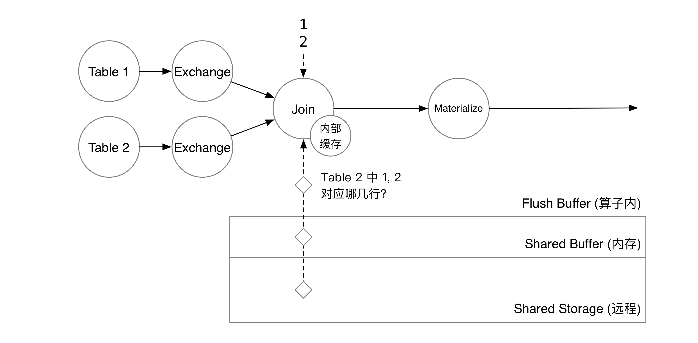
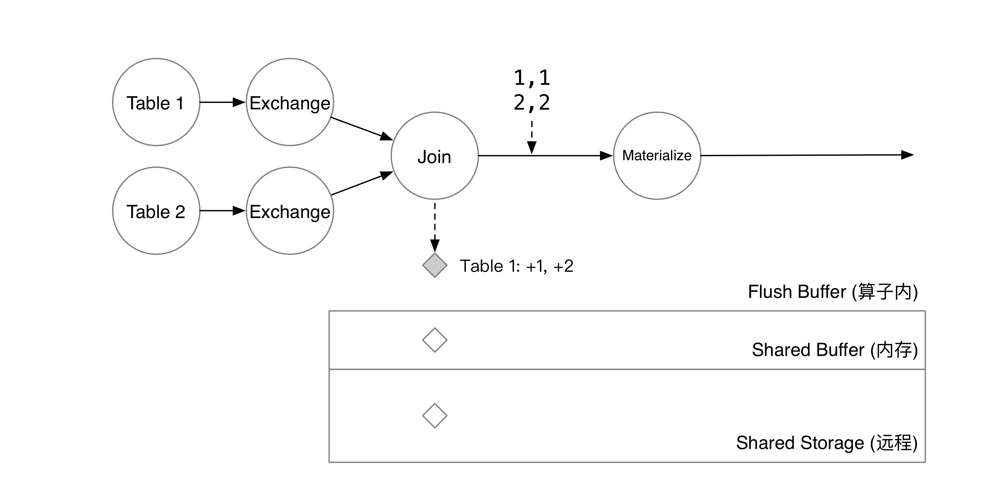
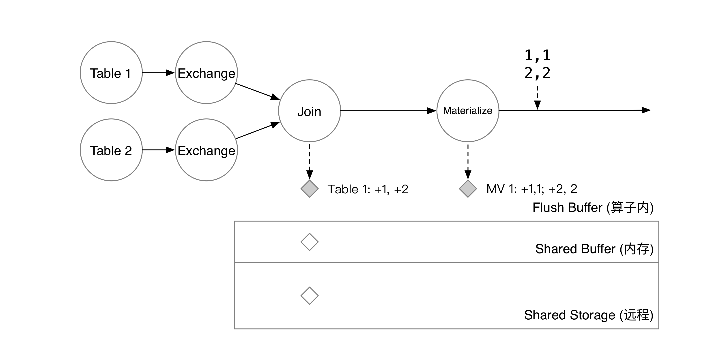
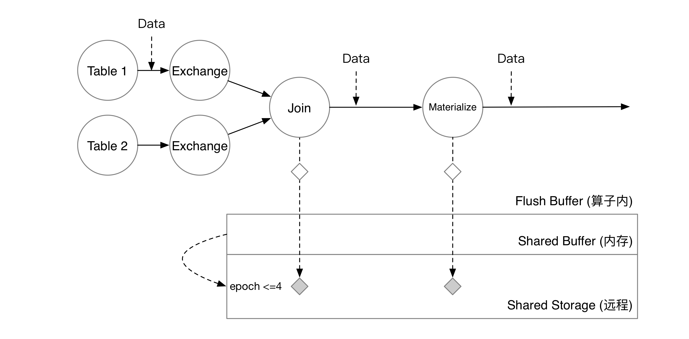
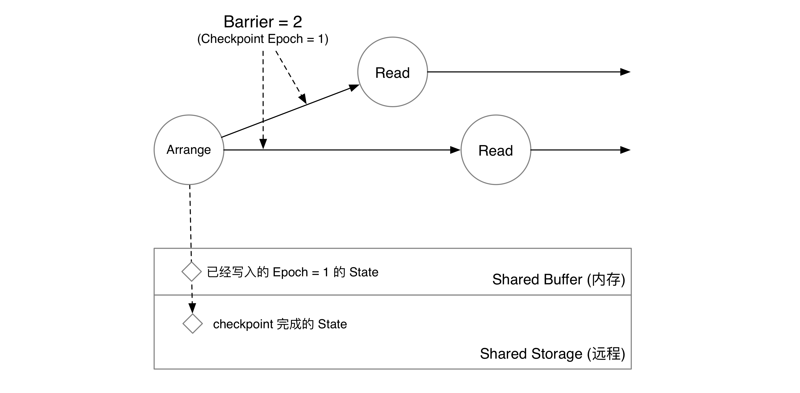
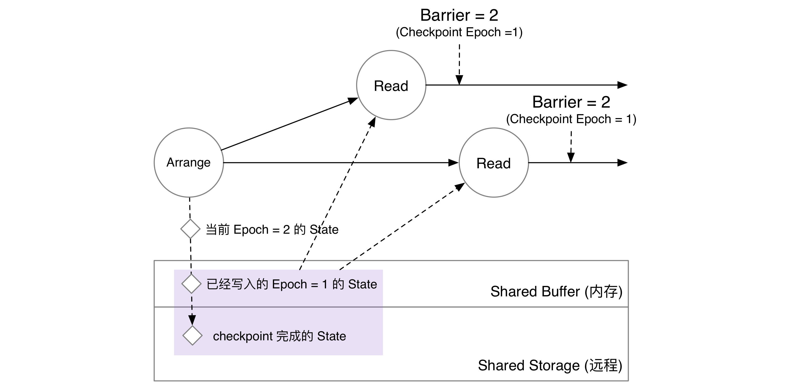
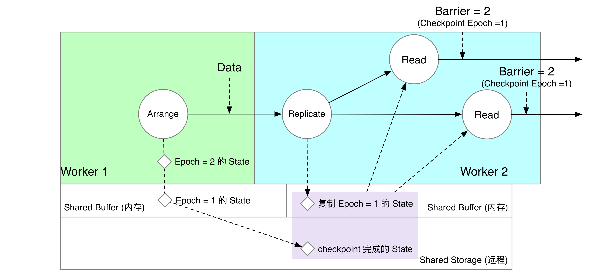
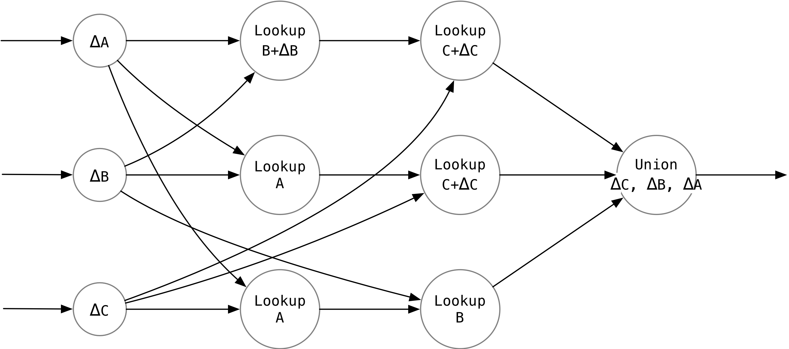
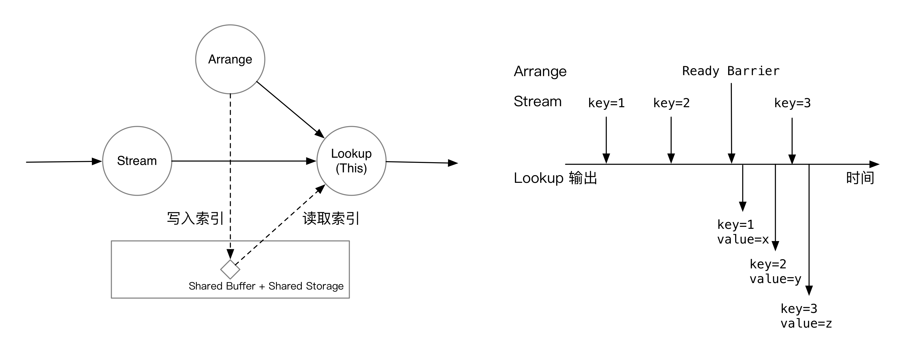

+++
title = "流处理引擎中基于共享状态索引的 Delta Join"
date = "2022-05-29T23:00:00+08:00"
toc = true
tags = ["Rust", "数据库", "流处理", "RisingWave", "索引", "共享状态"]
katex = true
categories = ["Tech"]
+++

在数据库系统中，我们可以通过创建索引的方式来加速 Join 计算的性能。比如 Postgres 就支持 [Index Scans][1]，通过扫描索引来加快 Join 的速度。然而，“索引”在流处理系统中很难实现。原因有二：

[1]: https://www.postgresql.org/docs/current/indexes-index-only-scans.html

* 流处理系统的中间状态通常来说都是“一写一读”的。流处理系统处理的是无边界的数据，需要通过状态存储来持久化计算的中间状态，在系统故障时从检查点恢复。而这些中间状态，通常只有单个并行度的单个算子读写，不会被共享。
* 索引并不是在图上流动的流数据，而是一个被算子查询的东西。通常来讲，流数据在计算图上流动，算子永远可以从网络上拿到上游算子推送过来的数据；流处理系统仅根据流上的数据和自己的中间状态进行运算。而索引则是一个需要主动查询（而非在图上流动）的东西，算子需要主动获取索引，才能得到最终的结果。

Differential Dataflow (DD) 实现了一种数据流系统上的索引 [Arrangement](https://arxiv.org/abs/1812.02639)。Arrangement 可以理解成是一个 MVCC 的索引，记录了 (索引键, 时间) -> 值 的映射。对流数据建立的 Arrangement 就是一种索引，下游算子可以高效地通过索引键来查询某个时间点对应的所有 value。然而，DD 是一个纯内存的系统，没有考虑索引如何持久化；与此同时，如果索引和下游算子不在一个节点上，DD 就需要通过网络上的 RPC 来从上游节点查询索引中的数据，容易影响计算延迟。

有了索引以后，我们就可以在流系统中支持一种无中间状态的 [Delta Join](https://materialize.com/joins-in-materialize/)。只要所有需要 Join 的表都根据等值条件建立了索引，Delta Join 就可以完全利用索引产生最终的 Join 结果，无需任何中间状态。（相对的，正常的 Join 则需要分别持久化左右两张表的数据；如果是多路 Join，还需要持久化每一次二路 Join 的结果）

在 RisingWave 中，我们通过状态存储提供的 MVCC 能力支持了基于共享状态的 Delta Join。本文将先介绍 RisingWave 在云原生存储上的数据持久化流程；而后，介绍共享状态的实现；最后，介绍 RisingWave 中 Delta Join 的实现。

## RisingWave 中的 Checkpoint

流处理系统持久化中间状态的过程被称为 checkpoint。在 RisingWave 中，checkpoint 是一个完全异步的过程。checkpoint 不影响流计算，算子可以持续不断地处理流上的数据，而无需关心 checkpoint 的进度。[Checkpoint in RisingWave](https://github.com/singularity-data/risingwave/blob/main/docs/checkpoint.md) 详细介绍了这一流程。在这里，我们简单地梳理一下 checkpoint 流程中可能与共享状态相关的部分。

RisingWave 的状态存储引擎“Hummock”的数据主要存在两个地方：每个节点自己的 Shared Buffer，和对象存储服务（可以是 MinIO、S3 等）。Shared Buffer 以 checkpoint 的 epoch 来组织数据；对象存储服务上用 LSM 树来组织数据。Hummock 中存储的是某一个时间点的快照。算子在某个 epoch 内计算的中间状态保存在算子内部的 flush buffer 中。

我们以一个简单的 query 为例：

```sql
CREATE MATERIALIZED VIEW mv_1 AS
  SELECT * FROM t1, t2
    WHERE t1.v1 = t2.v2
```

这个 query 会产生两个 TableScan，一个 Join，和一个 Materialize 算子。TableScan 算子用于实时注入内部表（或外部数据源）的增量数据；Join 算子用于达成 `t1.v1 = t2.v2` 这个 Join 条件；Materialize 算子将最终结果物化到存储中，以便用户之后通过 `select * from mv_1` 查询。假设 `t1`, `t2` 两张表都只有一列，分别是 `v1`, `v2`。此时，用户在 `t1` 中插入了两行 `1, 2`。


两行数据到达 Join 算子后，算子会从算子内部的缓存中查询 `t2` 中是否有这两行。如果缓存没有命中，则会从状态存储中查询数据。状态存储会扫描 Shared Buffer 和共享存储上的数据，合并 flush buffer 后得到 `t2` 对应的两行。



匹配到数据后，`t1` 新增的两行会被写到算子的 flush buffer 中。与此同时，匹配的数据会通过数据流传到下游算子。



下游物化算子会将新增的两行保存到自己的 flush buffer 中。



此时，系统决定开始一次 checkpoint。RisingWave 的元信息服务会在 checkpoint 开始时，将 barrier 注入到所有数据源中。在这个例子里，数据源有 `Table 1` `Table 2` 两个。系统注入了 epoch = 5 的 Barrier，这意味着 epoch = 4 的数据将被算子写入到状态存储中，而收到 Barrier 的算子接下来将处理 epoch = 5 的数据。


Join 算子对其两个上游的 barrier。收到 barrier 后，算子将 flush buffer 里的数据以 KV 对的形式写入到状态存储的 shared buffer 中，算子就可以开始处理下一批数据了。


Barrier 流过 Materialize 算子后，物化结果也会被写入 shared buffer 中。


当 barrier 流过整张图后，每个计算节点会将 shared buffer 中的数据在后台编码成 SST 并上传到对象存储服务上。当所有节点都上传完成后，checkpoint 就宣告完成了。此时，shared buffer 将清空已经 checkpoint 完成的数据，共享存储上的数据也将对用户的批查询可见。



此时用户执行 `SELECT * FROM mv_1`，就能看到最新的数据了。

因此，对于算子来说，checkpoint 就是简单地将数据编码并写到 shared buffer 中，不需要等待任何 I/O 操作。计算节点在后台会将写入 shared buffer 的数据上传到共享存储上，异步地完成 checkpoint 过程，在此期间完全不会影响流算子的正常计算。

## 共享状态与索引

讲完 RisingWave 的 barrier-based checkpoint 流程，我们就可以开始讨论如何在这样的一套系统里实现共享状态了。

### 索引

在 RisingWave 中，可以共享的状态只有“索引”这一种特殊的物化视图。

```sql
CREATE TABLE table(v1 int, v2 int, v3 int);
CREATE INDEX idx on table(v1, v2);
```

`CREATE INDEX` 就相当于：

```sql
CREATE MATERIALIZED VIEW idx AS
  SELECT * FROM table ORDER BY v1, v2;
```

所谓的索引，就是按照用户指定的索引 key 排序的一个特殊物化视图。物化视图本质上就是按一定规则排序的 KV 对。如果算子要查询 `v1 = 1, v2 = 2` 对应的所有记录，它只需要在索引视图中按顺序扫描以 `[1, 2]` 开头的所有记录即可。索引物化视图使用 Arrange 算子构建。

接下来我们讨论如何实现共享索引——让多个下游算子同时访问这个索引（共享状态）。在 RisingWave 里，大部分状态都是“一写一读”的（虽然实际上这些数据大家都可以直接通过共享存储访问到）。比如 Join 就只会读写当前算子负责的的 join key。数据放在共享存储上，只是方便了调整并行度 (scale-in, scale-out)。要实现“一写多读”的状态，需要考虑以下几点：

* 怎么保证算子能读到一致的状态？如果某个中间状态处于正在被写入的过程中，那么对于这个状态的访问一致性有问题，需要做一些特殊处理。
* 读取共享状态如何减少对于流算子的影响？如果每次读取共享状态都需要访问共享存储，或是通过 RPC 向上游计算节点查询，会极大地影响流计算的实时性。

### 单节点共享状态

单节点的共享状态讨论起来最为简单，我们先假设有一种名为“Read”的算子，需要读取共享状态。Read 算子恰巧和 Arrange 算子处于同一个计算节点上。

Arrange 算子收到 barrier。


算子将 epoch = 1 的数据写入 Shared Buffer 中，并将 barrier 发送到下游。



Read 算子收到 barrier，就意味着上游算子已经将自己的状态写入 Shared Buffer 中。因此，单节点场景下，下游算子直接读取 Arrange 算子在 Shared Buffer 中已经写入的 epoch = 1 的信息即可。存储收到读 epoch = 1 的请求后，会将共享存储上 epoch < 1 和 Shared Buffer 中 epoch = 1 的数据合并起来，得到 epoch = 1 Arrange 算子在状态存储中完整的状态快照。



### 跨节点共享状态

如果 Arrange 算子和 Read 算子没有被调度在同一个节点上，我们就需要通过某种方式远程获取上游算子写入的状态了。RisingWave 采用了消息复制的方案：共享状态由上游算子写入共享存储，下游算子收到消息后仅写入 Shared Buffer 中。等 checkpoint 完成，下游丢掉内存数据，直接从共享存储上获得完整快照。下面用一个例子来详细叙述这个过程：

Arrange 和 Read 算子被分配在两个节点上。我们在下游计算节点中，为 Arrange 算子创建一个“影子算子” Replicate。Replicate 算子收到上游 Worker 1 Arrange 发来的数据后，就将数据复制一份写入下游算子 Worker 2 的 Shared Buffer 中。


Read 算子收到 Barrier，意味着自己负责计算的数据已经在自己所在的节点上可以读到了。如下图所示，Read 算子读取的内容实际上是当前节点 Shared Buffer 中复制的数据，以及共享存储上的数据。在这个时刻，Arrange 算子写下去的内容，在上下游算子的 Shared Buffer 中同时存在。



在 Checkpoint 过程中，只有 Worker 1 Arrange 所在的节点会将 Shared Buffer 的状态上传到共享存储上。下游 Worker 2 会直接销毁内存中 Replicate 复制的“影子数据”。此时，如果算子发起读 epoch = 1 的请求，就可以全部从共享存储上读到了。


## Delta Join

[Delta Join](https://materialize.com/joins-in-materialize/) 是一种没有中间状态的 Join 实现。流数据库 Materialize 实现了这种 Join。Materialize 是基于 DD 做的，每一条记录都自带时间戳，因此做起来比较方便。在 RisingWave 中，checkpoint 是以 barrier / epoch 为单位进行的，因此需要一些特别的设计才能做 delta join。

### 数学原理

实现了共享状态后，我们就可以通过 Delta Join 来复用索引算子的状态，实现共享索引了。

对于流处理系统来说， $A \Join B$ 这个 query，每个 epoch 实际要计算的是 $\Delta (A \Join B)$。对于 Inner Eq Join，该式可以展开成：

$[\Delta A \Join (B + \Delta B)] \cup (\Delta B \Join A)$

对于三路 Join $\Delta (A \Join B \Join C)$，可以展开成：

$\Delta A \Join (B \cup \Delta B) \Join (C \cup \Delta C) \cup \Delta B \Join A \Join (C \cup \Delta C) \cup \Delta C \Join A \Join B$

容易发现，n 路 Join 的增量，永远都可以展开成 n 项式，每一项都是 n 项的积。其中：
* 第一项是 $\Delta T$。
* 每张表只出现一次。
* 每张表出现的形式要么是 $T$, 要么是 $T + \Delta T$。

在 RisingWave 里，我们可以用计算图来表示这种 Delta Join 运算。 $T + \Delta T$ 代表当前 epoch 的索引； $T$ 代表上一个 epoch 的索引。

使用上面的式子做三路 Join，如果三张表都使用同一个等值条件，我们就可以构造出下面这个执行计划：



每一行恰好对应式子中的一项。

三路 Lookup 算子合并的时候需要一个特殊的 Union 算子，先输出 $\Delta C$ 一路的数据，再输出 $\Delta B$ 一路的数据，最后输出 $\Delta A$ 一路的数据。否则会导致有因果关系的两条记录顺序颠倒，产生错误的结果。

### Lookup 算子实现

Lookup 算子做的事情就是流表 Join。它一个输入是流，一个输入是索引（可以是 Replicate，也可以直接接 Arrange）。

如果是 Lookup 当前 epoch 的索引，Lookup 算子会等到 Arrange 一侧的 barrier 到来后再开始计算。如图所示，收到 ready barrier 前，Lookup 算子会将流上的数据缓存下来；收到 barrier 后，就会立刻开始处理积压的数据，在索引中匹配流上 join key 对应的数据。



如果是 Lookup 上一个 epoch 的索引，由于 Lookup 算子会对齐 barrier，处理当前 epoch 数据的时候，肯定已经收过上一个 epoch 的 barrier。所以，上一个 epoch 的索引必然已经可以访问了。在这个模式下，Lookup 收到一条消息，就会匹配一条消息。


### Delta Join 在优化器中的表示

Delta Join 的计算图由 `LogicalMultiWayJoin` 生成。如果索引匹配上了，优化器就会将逻辑多路 Join 计划转换为 Delta Join 计算图。Lookup 算子在优化器中的表示和 HashJoin 类似，可以和正常的算子一样做谓词下推等优化。特别的，在生成 n 路 Delta Join 计划时，我们使用 Delta Join 求解器来生成最佳的 Lookup 顺序，用贪心算法选择每一路的表的顺序，保证 shuffle 的次数最小。

## 总结

RisingWave 中的状态共享和 Join 优化已初具雏形。我们在 MVCC 状态存储的基础上实现了流处理系统的共享状态和索引，并基于此做了基于索引的 Join 优化。未来还有许多优化可以做，比如支持二级索引、支持共享缓存、支持更多 Join 类型等等。关于这些 topics，下次一定介绍 🤪。

广告时间：[RisingWave](https://github.com/singularity-data/risingwave) 是 [Singularity Data, Inc.](https://singularity-data.com) 开源的 Rust 实现的流数据库产品。关于什么是流数据库，欢迎收听[牛油果烤面包第 95 期：流数据库](https://avocadotoast.typlog.io/episodes/streamdb)。

---

欢迎在这篇文章对应的 [GitHub Issue](https://github.com/skyzh/skyzh-site/issues/17) 下使用 GitHub 账号评论、交流你的想法。
